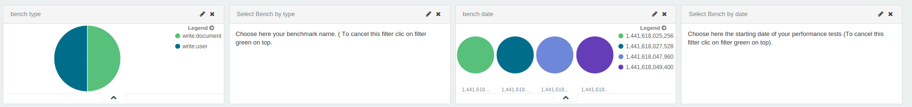

# Kibana Configuration

Kibana is available to the adress http://localhost:5601

All the configuration process below will be saved in the persisted `elasticlogstash` index.
So it must be done only one time.

Be sure to have send `testName` and `testStartDate` (see [Data to send from my stress test](./README.md))

 * Open http://localhost:5601
 * Choose the logstash-* index, (if logstash already received some requests, you must see some logs in the Discover pannel)
 * Click on the field Time-field-name and choose @timestamp,
 * Click the "create" button,
 * Go to Settings->Objects and choose "Dashboards panel",
 * Click Import button. Choose the file from Kuzzle directory at [/config/perf/kibanadashboard.json](./kibanadashboard.json)

The dashboard panel, Searches and Visualizations must be populated.
You can now go to Dashboard and load the "perf DashBoard".

# Global perfs DashBoard : navigate into your tests

The `Global Perf` DashBoard is used to navigate into all your tests.
Suppose you launch several tests on several subjects, the first line of the dashboard is used as a test selector.
To navigate on your differents tests, you can filter on the bench type, and on the starting date.

The first line of the global perf is about choosing you test from both name (first item) and date (third item). 

# How to remove all the logs already saved in my ELK ?
As a curl command you can do :

`curl -XDELETE 'http://localhost:9200/logstash-*/'`

You can replace the * by a specific day (example `logstash-2015.08.07`).

#Refresh field list in Kibana :
Every time you add/modify/delete the fields in your log, you must refresh fields list in Kibana

 * go to Setting,
 * click "logstash-*"
 * click on the orange "reload" button.

