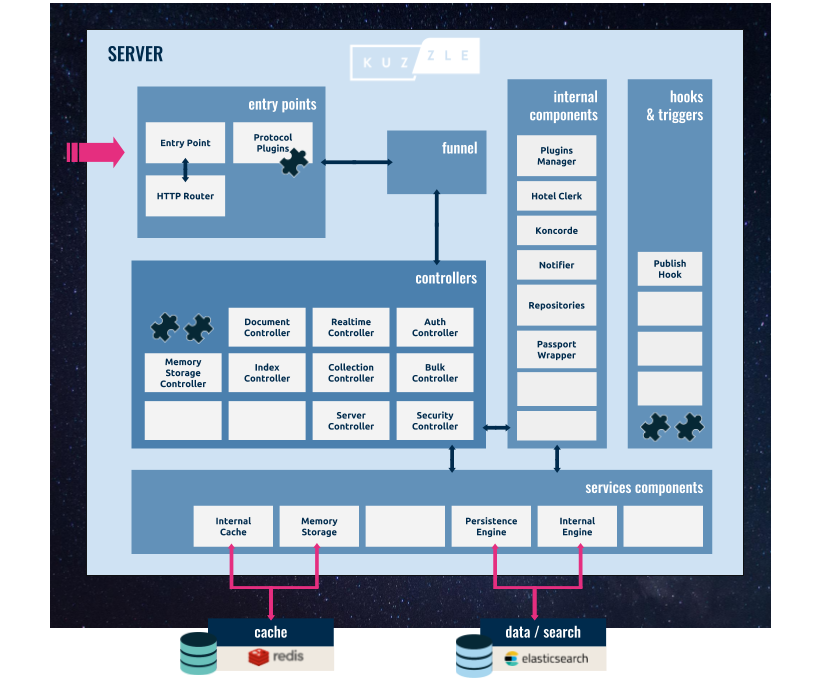

# Architecture

In this section we'll take a closer look at Kuzzle's server architecture.

## Core Components

The diagram above depicts the various components that make up the server architecture, these are:

- **Entry Points**: handles the incoming message and sends them to the _Funnel_.
- **Router**: exposes the HTTP endpoints, normalizes any request, and forwards it to the _Funnel_.
- **Funnel**: receives normalized requests and forwards it to the appropriate controller, sends results back to the _Entry Points_.
- **Controllers**: receives data fom the _Funnel_, processes it, and returns a result to the _Funnel_ (see [API reference](/core/1/api)).
- **Internal Components**: are internal modules used by controllers to process a request.
- **Service Components**: are interfaces used by controllers to connect to external services (see [below](/core/1/guides/kuzzle-depth//#services)).

## Services

In our architecture, a "Service" is an interface that interacts with external components.

Kuzzle currently implements the following Services:

- [elasticsearch.js](https://github.com/kuzzleio/kuzzle/blob/master/lib/services/elasticsearch.js): interface to [Elasticsearch](https://www.elastic.co/products/elasticsearch), used for persistent data storage.
- [redis.js](https://github.com/kuzzleio/kuzzle/blob/master/lib/services/redis.js): interface to the [redis](http://redis.io), used as a cache.
- [internalEngine.js](https://github.com/kuzzleio/kuzzle/blob/master/lib/services/internalEngine): interface to Kuzzle's configuration index in Elastic Search.

A Service can be used by more than one Service Component. For example, Redis is used by both the Internal Cache Service Component and the Memory Storage Service Component (see [default.config.js](https://github.com/kuzzleio/kuzzle/blob/master/default.config.js)).
