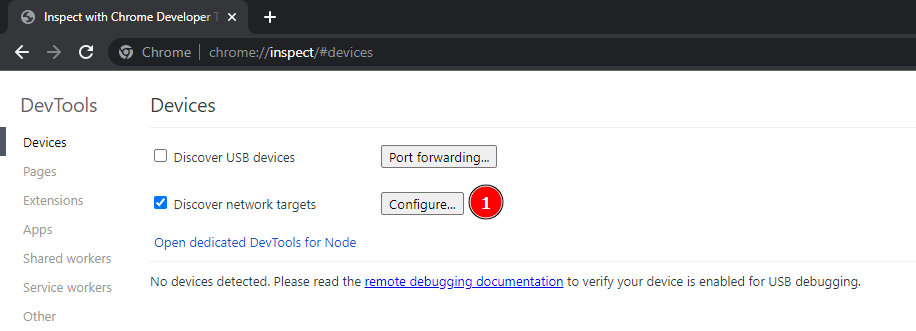
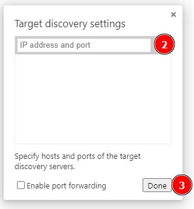
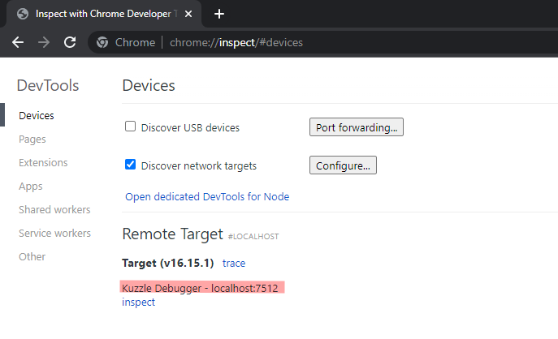

## Introduction

Kuzzle gives the possibility to debug a Kuzzle instance using the [Debug Controller](/core/2/api/controllers/debug) actions.

The Debug Controller gives you the ability to execute methods and listen to events from the [Chrome Devtool Protocol](https://chromedevtools.github.io/devtools-protocol/v8) or [Debug Modules](#debug-modules).

It's easier and safer to use the [Debug Controller](/core/2/api/controllers/debug) to debug Kuzzle remotely than exposing the debugger port using `node --inspect` since the [Debug Controller](/core/2/api/controllers/debug) is limited by the authentication mechanism of Kuzzle making it impossible to use if you dont have the proper rights to use it.
Whereas when launching Kuzzle with `node --inspect` you need to setup some Port Forwaring from your host machine to your local machine to be able to debug Kuzzle remotely, and you need to be sure that no once can access your instance using the Debug Port exposed.

:::warn
By default access to the [Chrome Devtool Protocol](https://chromedevtools.github.io/devtools-protocol/v8) through the [Debug Controller](/core/2/api/controllers/debug) is disabled, to use the methods of the [Chrome Devtool Protocol](https://chromedevtools.github.io/devtools-protocol/v8) you need to enable it in the [kuzzlerc file](https://github.com/kuzzleio/kuzzle/blob/master/.kuzzlerc.sample)
at `security.debug.native_debug_protocol` and reboot your instance.

[Debug Modules](#debug-modules) are still accessible when `security.debug.native_debug_protocol` is disabled.
:::

## Debug Modules

Debug Modules are modules of Kuzzle that are exposed through the [Debug Controller](/core/2/api/controllers/debug) actions and allows you to better understance what is happening on your instance and helps you debug you instance live.

Debug Modules have nothing to do with the [Chrome Devtool Protocol](https://chromedevtools.github.io/devtools-protocol/v8) and are perfectly safe whereas [Chrome Devtool Protocol](https://chromedevtools.github.io/devtools-protocol/v8) could be used to execute code remotely which is why access to the [Chrome Devtool Protocol](https://chromedevtools.github.io/devtools-protocol/v8) is disabled by default in the config and should only be enabled when you need to take memory snapshot, use breakpoint, the cpu profiler, etc.

## Debug Kuzzle remotely using the Debug Controller and the Chrome Inspector

### Prerequisite

To be able to debug Kuzzle remotely using the Chrome Inspector tool you need:

- A user that has access to the every actions of the [Debug Controller](/core/2/api/controllers/debug), see the [Permissions](/core/2/main-concepts/permissions) page on how to setup the proper permissions.
- You need to set the config `security.debug.native_debug_protocol` to `true`, to allow the [Debug Controller](/core/2/api/controllers/debug) to execute actions from the [Chrome Devtool Protocol](https://chromedevtools.github.io/devtools-protocol/v8), then restart your instance. 
- You need to have [Kourou](https://github.com/kuzzleio/kourou) the Kuzzle CLI installed. You can install it using `npm install -g kourou`
- You need to have the [Chrome Browser](https://www.google.com/intl/en_en/chrome/) installed.

### How to

#### Step 1

To debug Kuzzle remotely using the Chrome Inspector you need to open a server proxy that will connects to Kuzzle and translate commands sent by the Chrome Inspector into actions of [Debug Controller](/core/2/api/controllers/debug).
**Dont worry this is very easy to do**, you just have to use kourou to do that, just run

```bash
kourou app:debug-proxy --host <Kuzzle Host> --port <Kuzzle Port> --username <username> --password <user password>
```

This will open a server proxy that will connects to your Kuzzle instance using the username and password given.

:::warn
Remember the user should have the permissions to use all the actions of [Debug Controller](/core/2/api/controllers/debug) and you need to set the config `security.debug.native_debug_protocol` to `true`, to allow the [Debug Controller](/core/2/api/controllers/debug) to execute actions from the [Chrome Devtool Protocol](https://chromedevtools.github.io/devtools-protocol/v8) 
:::

Once the server proxy has started and has successfuly connect to your Kuzzle instance will see a message like this in your terminal:
```bash
[ℹ] Connecting to ws://<host>:<port> ...
[ℹ] Connected to Kuzzle node: knode-lackadaisical-archimedes-79903
[✔] Listening on port 9222, forwarding to Kuzzle at <host>:<port>
[ℹ] Showing to Chrome Debugger as "Kuzzle Debugger - <host>:<port>"
[ℹ] Waiting for Chrome Debugger to connect...
```

```bash
[✔] Listening on port 9222, forwarding to Kuzzle at <host>:<port>
```
You can see here that the server proxy is listening on port `9222` this will be needed for the next step.

If you see those messages you can then proceed to the next step.

#### Step 2

The server proxy is now setuped you need to open the Chrome Inspector to debug you instance, to do that you can open this url `chrome://inspect` in [Chrome Browser](https://www.google.com/intl/en_en/chrome/).
This will open you the debug interface of Chrome which will be used to debug the Kuzzle instance.

To allow the Chrome Inspector to see our server proxy exposed by the command `kourou app:debug-proxy`
we need to configure add the `localhost:9222` target.

:::info
Here we are using the port `9222` but keep in mind that this port can be another one and you need to change it accordingly on what port the server proxy is listening to, see end of [Step 1](#step-1)

The host will always be localhost since it's the IP of the server proxy that is running on your machine.
:::

**1 -** Click on the `Configure` button, a dialog will appear where you can enter your target.


**2 -** Enter your local target, here  `localhost:9222`
**3 -** Confirm


**If everything worked so far you should see a new Remote Target called** `Kuzzle Debugger - <Instance Host>:<Instance Port>`.



**4 -** You can now click on `inspect` and your done, you can now debug your instance remotely using the Chrome Inspector.

:::warn
Dont forget to set the config `security.debug.native_debug_protocol` back to `false` once your done debugging to increase the security of your instance in case of one of your admin users with access to the [Debug Controller](/core/2/api/controllers/debug) gets compromised.
:::