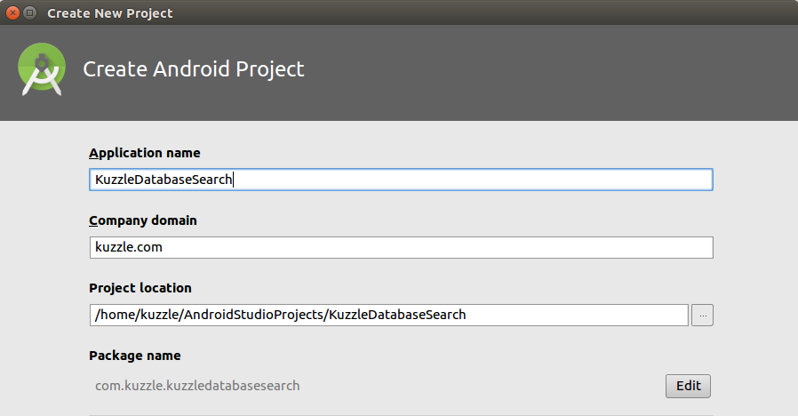

## Database Search with Android

Let's create a new Android project.



There's no need to add an Activity because we will only be using the project to perform a test.


Once the project is created we can add the Kuzzle Android SDK. Add this line to your `build.gradle` file:

```
    implementation 'io.kuzzle:sdk-android:3.0.2'
```

Now create a Class that will handle the database search test, we will call it `DatabaseSearchSnippet`.

## Connect to Kuzzle

The first thing we need to do is connect to Kuzzle. To do this write the following code:

```Java
    kuzzle  = new Kuzzle("localhost");
```

Here we assume you have installed Kuzzle on your localhost, if this is not the case replace the `localhost` with the ip or name of the Kuzzle server.

## Create a Document

Now that we have established a connection to Kuzzle, we will create a document in our `planets` collection. To do this, create a JSONObject with the contents of the document.

In this case we create a JSONObject with name `Geonosis` and terrain `mountain`:

```Java
Collection collection = kuzzle.collection("planets", "galaxies");
Document document = new Document(collection);
JSONObject currentLocation = new JSONObject().put("name", "Geonosis").put("terrain", "mountain");
document.setContent(currentLocation, true);
collection.createDocument(document);
```

## Search for the Document

Now that the document is created and stored in Kuzzle, let's perform a search that will return this document in the result.

First we need to define the search criteria. Here we use the `match` term to find any document that has a `mountain` terrain. For additional terms refer to our [Elasticsearch Cookbook](/core/2/guides/cookbooks/elasticsearch) or Elasticsearch's own documentation.

Create the JSONObject with the search criteria:

```Java
        JSONObject searchCriteria = new JSONObject()
                                        .put("query", new JSONObject()
                                                          .put("match", new JSONObject()
                                                                            .put("terrain", "mountain")));

```

Then use the JSONObject to perform the search on the `galaxies` collection:

```Java
kuzzle.collection("planets", "galaxies")
      .search(searchCriteria, new ResponseListener<SearchResult>() {
          @Override
          public void onSuccess(SearchResult response) {
              //Do something with the matching documents
              doSomething(response.getDocuments());
          }

          @Override
          public void onError(JSONObject error) {
              handleError(error);
          }
      });
```

## Run the Test

The full code should look something like this:

```Java
/* Test Class */

public void test(){
    try {
        kuzzle  = new Kuzzle("localhost");

        //Create a document
        Collection collection = kuzzle.collection("planets", "galaxies");
        Document document = new Document(collection);
        JSONObject currentLocation = new JSONObject().put("name", "Geonosis").put("terrain", "mountain");
        document.setContent(currentLocation, true);
        collection.createDocument(document);


        //Now search for the document
        JSONObject searchCriteria = new JSONObject()
                                        .put("query", new JSONObject()
                                                            .put("match", new JSONObject()
                                                                            .put("terrain", "mountain")));

        kuzzle.collection("planets", "galaxies")
                .search(searchCriteria, new ResponseListener<SearchResult>() {
                    @Override
                    public void onSuccess(SearchResult response) {
                        //Do something with the matching documents
                        doSomething(response.getDocuments());
                    }

                    @Override
                    public void onError(JSONObject error) {
                        handleError(error);
                    }
                });

    } catch (Exception e) {
        handleError(e);
    }
}
```
