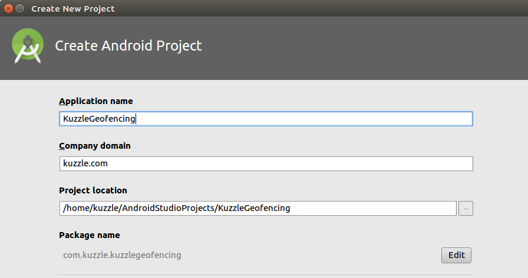
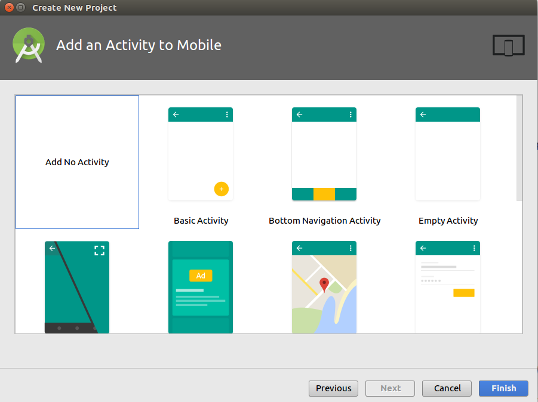

## Geofencing with Android

Let's create a new Android project.



There's no need to add an Activity because we will only be using the project to perform a test.



Once the project is created we can add the Kuzzle Android SDK. Add this line to your `build.gradle` file:

```
    implementation 'io.kuzzle:sdk-android:3.0.2'
```

Now create a Class that will handle the Geofencing test, we will call it `GeoFenceSnippet`.

## Connect to Kuzzle

The first thing we need to do is connect to Kuzzle. To do this write the following code:

```Java
kuzzle  = new Kuzzle("localhost");
```

Here we assume you have installed Kuzzle on your localhost, if this is not the case replace the `localhost` with the ip or name of the Kuzzle server.

## Create a Geographical Boundary

Now that we have established a connection to Kuzzle, we will perform a subscription request that tells Kuzzle that the App wants to be notified anytime a user leaves a geographical boundary.

We define the geographical boundary in a JSONObject as follows:

```Java
JSONObject bigBen = new JSONObject().put("lat", 51.510357).put("lon",  -0.116773);
JSONObject filter = new JSONObject().put("geoDistance", new JSONObject().put("location", bigBen).put("distance", "2km"));
```

This defines a circular boundary centered around [Big Ben](https://www.google.com/maps/place/Big+Ben/@51.510357,-0.116773,15z/data=!4m12!1m6!3m5!1s0x0:0xb78f2474b9a45aa9!2sBig+Ben!8m2!3d51.5007292!4d-0.116773!3m4!1s0x0:0xb78f2474b9a45aa9!8m2!3d51.5007292!4d-0.1246254) with a radius of 2km. For more information about the `geoDistance` filter click [here](/core/2/guides/cookbooks/realtime-api/terms#geodistance).

Note that we use the field name `location` to store the geopoint we are centered around. This means that Kuzzle will monitor the field named `location` for position changes, and so any user location document sent to Kuzzle must also contain this field.

Now the App must request a subscription to the geographical boundary defined in our `filter` object. To ensure that the App only receives a message when the `location` changes from inside the boundary to outside the boundary, we need to set the subscription scope to `out`, for more scope options click [here](/sdk/android/3/core-classes/collection/subscribe).

Let's create a _subscribe_ method and add the following code to it:

```Java
private void subscribe() throws JSONException {

    kuzzle.collection("mycollection", "myindex")
            .subscribe(filter, new RoomOptions().setScope(Scope.OUT), new ResponseListener<NotificationResponse>() {
                @Override
                public void onSuccess(NotificationResponse response) {
                    // triggered each time the user leaves the circular area around Big Ben
                    System.out.println("User has left Big Ben!");
                    doSomething(response);
                }

                @Override
                public void onError(JSONObject error) {
                    handleError(error);
                }
            });
}
```

Since we are also going to publish the user's location from the same App, we will want to know when the subscription is successful so that we can then publish the user's location. We can do this by using the `.onDone()` method on our subscription request:

```Java
kuzzle.collection("mycollection", "myindex")
      .subscribe(/* ... */).onDone(new ResponseListener<Room>() {
            @Override
            public void onSuccess(Room response) {
                try {
                    publish();
                }
                catch(Exception e){
                    handleError(e);
                }
            }

            @Override
            public void onError(JSONObject error) {
                handleError(error);
            }
      });
```

We have now programmed the subscription side of the test.

## Place the User Inside the Geographical Boundary

Now let's move on to the publish side of the test. Here we will create a document that represents the user's location, placed inside the circular boundary around Big Ben.

We will program a _publish_ method that creates a document that contains three fields: `firstName`, `lastName` and `location`.

Let's start by creating the user _Ada Lovelace_ located at Big Ben. Create the Document object as follows:

```Java
private void publish() throws JSONException {
    Collection collection = kuzzle.collection("myindex", "mycollection");
    Document document = new Document(collection);
    JSONObject bigBen = new JSONObject().put("lat", 51.510357).put("lon", -0.116773);
    JSONObject currentLocation = new JSONObject().put("firstName", "Ada").put("lastName", "Lovelace").put("location", bigBen);
    document.setContent(currentLocation, true);
}
```

Now we create this document in Kuzzle.

```Java
private void publish() throws JSONException {
    /* ... */
    collection.createDocument("326c8f08-63b0-429f-8917-b782d3093011", currentLocation, new ResponseListener<Document>() {
        @Override
        public void onSuccess(Document response) {

        }

        @Override
        public void onError(JSONObject error) {

        }
    });
}
```

Notice that we have included a document id, this is so that we can easily reference the document later on. We can also leave the id empty and Kuzzle will generate one automatically.

## Place the User Outside the Geographical Boundary

If the document creation is successful we can go ahead and update it to change the user's location to somewhere outside the geographical boundary. Let's move the user to [Hyde Park](https://www.google.com/maps/place/Hyde+Park/@51.507268,-0.165730,15z/data=!4m5!3m4!1s0x0:0xd1af6c4f49b4bd0c!8m2!3d51.507268!4d-0.165730). Since this is an update we need to do it after the first location document is created.

```Java
private void publish() throws JSONException {
    /* ... */
    collection.createDocument("326c8f08-63b0-429f-8917-b782d3093011", currentLocation, new ResponseListener<Document>() {
        @Override
        public void onSuccess(Document response) {
            try {
                JSONObject hydePark = new JSONObject().put("lat", 51.507268).put("lon", -0.165730);
                JSONObject newLocation = new JSONObject().put("location", hydePark);
                kuzzle.collection("mycollection", "myindex")
                        .updateDocument("326c8f08-63b0-429f-8917-b782d3093011", newLocation);
            }
            catch(Exception e){
                handleError(e);
            }
        }

        @Override
        public void onError(JSONObject error) {

        }
    });
}
```

When the document update request is sent to Kuzzle, it will detect the change in location and send a message to the subscriber, which in this case is our App.

## Run the Test

The full code should look something like this:

```Java

/* Test Class */

public void test(){
    try {
        kuzzle  = new Kuzzle("localhost");
        subscribe();
    } catch (Exception e) {
        handleError(e);
    }
}

/**
 * The subscription side of the pubsub
 */
private void subscribe() throws JSONException {

    /**
    * Subscribe:
    * A client subscribes to Kuzzle and is notified when the user leaves a circular area
    */

    //Create a filter that defines the circular area around Big Ben
    JSONObject bigBen = new JSONObject().put("lat", 51.510357).put("lon",  -0.116773);
    JSONObject filter = new JSONObject()
            .put("geoDistance", new JSONObject()
                    .put("location", bigBen)
                    .put("distance", "2km"));

    //Create a subscription that triggers a notification when a user the circular area
    kuzzle.collection("mycollection", "myindex")
            .subscribe(filter, new RoomOptions().setScope(Scope.OUT), new ResponseListener<NotificationResponse>() {
                @Override
                public void onSuccess(NotificationResponse response) {
                    // triggered each time the user leaves the circular area around Big Ben
                    System.out.println("User has left Big Ben!");
                    doSomething(response);
                }

                @Override
                public void onError(JSONObject error) {
                    handleError(error);
                }
            }).onDone(new ResponseListener<Room>() {
                @Override
                public void onSuccess(Room response) {
                    try {
                        publish();
                    }
                    catch(Exception e){
                        handleError(e);
                    }
                }

                @Override
                public void onError(JSONObject error) {
                    // Handle subscription error
                    handleError(error);
                }
            });
}

/**
 * The publish side of the pubsub
 */
private void publish() throws JSONException {

    /**
    * Publish:
    * A client publishes a user's location
    */

    //Create the user's location: they are inside the circular area
    Collection collection = kuzzle.collection("mycollection", "myindex");
    Document document = new Document(collection);
    JSONObject bigBen = new JSONObject().put("lat", 51.510357).put("lon", -0.116773);
    JSONObject currentLocation = new JSONObject().put("firstName", "Ada").put("lastName", "Lovelace").put("location", bigBen);
    document.setContent(currentLocation, true);
    collection.createDocument("326c8f08-63b0-429f-8917-b782d3093011", currentLocation, new ResponseListener<Document>() {
        @Override
        public void onSuccess(Document response) {
            //After the user's location is stored we can update it: now they are outside the circular area -> This will trigger the notification
            try {
                JSONObject hydePark = new JSONObject().put("lat", 51.507268).put("lon", -0.165730);
                JSONObject newLocation = new JSONObject().put("location", hydePark);
                kuzzle.collection("mycollection", "myindex")
                        .updateDocument("326c8f08-63b0-429f-8917-b782d3093011", newLocation);
            }
            catch(Exception e){
                handleError(e);
            }
        }

        @Override
        public void onError(JSONObject error) {
            handleError(error);
        }
    });
}
```
