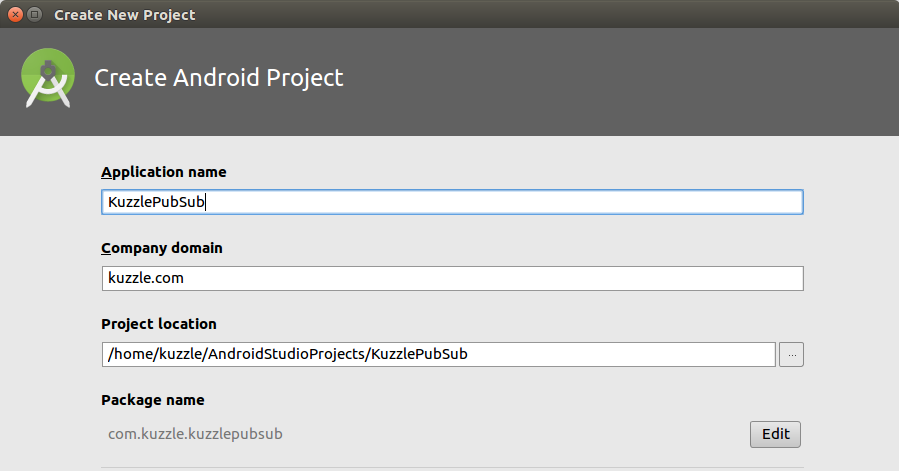

## Pub/Sub with Android

Let's create a new Android project.



There's no need to add an Activity because we will only be using the project to perform a test.


Once the project is created we can add the Kuzzle Android SDK. Add this line to your `build.gradle` file:

```
    implementation 'io.kuzzle:sdk-android:3.0.2'
```

Now create a Class that will handle the real-time pub/sub test, we will call it `RealtimePubSubSnippet`.

## Connect to Kuzzle

The first thing we need to do is connect to Kuzzle. We can do this in a method we'll call `test`, for example:

```Java
public void test(){
    //Connect to Kuzzle
    kuzzle = new Kuzzle("localhost");
}
```

Here we assume you have installed Kuzzle on your localhost, if this is not the case replace the `localhost` with the ip or name of the Kuzzle server.

## Subscribing to Documents

Let's create a _subscribe_ method where we will program the subscription side of the test:

```Java
private void subscribe() throws JSONException {
    /* TODO */
}
```

We will perform a subscription request that tells Kuzzle that the App wants to be notified anytime a document is created that contains the _message_ field. We define this subscription filter in a JSONObject as follows, for more information about filters click [here](/core/2/guides/cookbooks/realtime-api):

```Java
private void subscribe() throws JSONException {

    JSONObject filter = new JSONObject().put("exists", new JSONObject().put("field", "message"));

}
```

Use the Collection `subscribe` method to execute the subscription request, using the filter object as input.

```Java
private void subscribe() throws JSONException {

     JSONObject filter = new JSONObject().put("exists", new JSONObject().put("field", "message"));

     kuzzle.collection("mycollection", "myindex")
           .subscribe(filter,new ResponseListener<NotificationResponse>() {
                @Override
                public void onSuccess(NotificationResponse response) {
                    /** do something with the response*/
                }

                @Override
                public void onError(JSONObject error) {

                }
            });
}
```

We have now programmed the subscription side of the test. Let's move on to the _publish_ side.

## Publishing a Document

Now let's move on to the publish side of the test. Here we will publish a document that contains the `message` field. When Kuzzle receives this message, it will detect that there is a subscriber listening for such messages and will send it to these subscribers, in this case to our Android App.

We will program a _publish_ method that creates a document that contains the value `hello world` in the `message` field.

```Java
private void publish() throws JSONException {
    Collection collection = kuzzle.collection("mycollection", "myindex");
    Document document = new Document(collection);
    document.setContent("message", "hello world");
    collection.createDocument(document);
}
```

For this code example we are going to publish from the same client that is subscribing to the document filter. This is a quick way to demonstrate the pub/sub functionality of Kuzzle. So let's call the publish method right after we subscribe. Of course, we will want to know when the subscription is successful before we call the publish method. We can do this by using the `.onDone()` method on our subscription request:

```Java
private void subscribe() throws JSONException {
    /* ... */
    kuzzle.collection("mycollection", "myindex")
        .subscribe(/* ... */).onDone(new ResponseListener<Room>() {
            @Override
            public void onSuccess(Room response) {
                try {
                    publish();
                }
                catch(Exception e){
                    handleError(e);
                }
            }

            @Override
            public void onError(JSONObject error) {
                handleError(error);
            }
        });
}
```

We have now have a _subscribe_ method that will subscribe to `mycollection` and then publish a message that it will receive.

## Run the Test

We'll call the _subscribe_ method from inside our _test_ method. The full code should look something like this:

```Java
/* Test Class */

Kuzzle kuzzle;

public void test(){
    //Connect to Kuzzle
    kuzzle = new Kuzzle("localhost");
    //Run Subscribe & Publish
    subscribe();
}

private void subscribe() throws JSONException {

    //Create a filter that will be used to subscribe to document changes
    JSONObject filter = new JSONObject().put("exists", new JSONObject().put("field", "message"));

    //Subscribe to document changes using the filter
    kuzzle.collection("mycollection", "myindex")
            .subscribe(filter, new ResponseListener<NotificationResponse>() {
                @Override
                public void onSuccess(NotificationResponse response) {
                    /** do something with the response*/
                    doSomething(response);
                }

                @Override
                public void onError(JSONObject error) {
                    handleError(error);
                }
            }).onDone(new ResponseListener<Room>() {
                @Override
                public void onSuccess(Room response) {

                    try {
                        //Once we have subscribed, publish a message to Kuzzle
                        publish();
                    } catch (JSONException e) {
                        handleError(e);
                    }
                }

                @Override
                public void onError(JSONObject error) {
                    handleError(error);
                }
            });

}

private void publish() throws JSONException {
    // Create the document that will trigger the notification
    Collection collection = kuzzle.collection("mycollection", "myindex");
    Document document = new Document(collection);
    document.setContent("message", "hello world");
    collection.createDocument(document);
}
```
