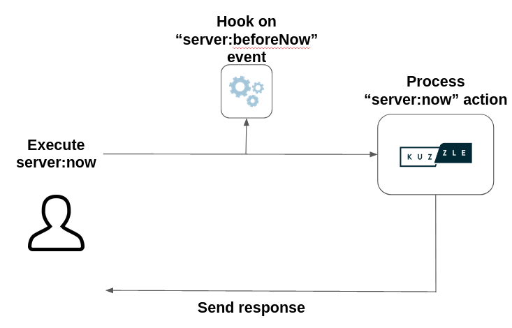

# Kuzzle Event System

Most of the **internal tasks performed by Kuzzle trigger events**.

These events allow to **perform additional** actions and even to **modify their behavior**.  

Kuzzle provides two mechanisms to connect to events, **pipes** and **hooks**.

::: info
The complete list of events is available here: [Internal Events List](/core/2/some-link)
:::

## Pipe

<!-- Duplicate with guides/getting-started/8-customize-api-behavior -->

Kuzzle allows to modify API actions behavior with a **very precise middleware-like system**.  

This system makes it possible to **modify the execution flow of requests** processed by Kuzzle.

Pipes are **functions plugged to events**, called **synchronously** by Kuzzle, and **receiving information** regarding that event.

Pipes can:
  - **Change the received information**. Kuzzle will use the updated information upon resuming the task
  - **Abort a task**. If a pipe throws an error, Kuzzle interrupts the task, and forwards a standardized version of the thrown error to the originating client


::: warning
Each event carries a different payload. **This payload must be returned by the pipe function** so Kuzzle can continue its execution process.
:::

Examples of pipes usage:
 - [dynamic right restrictions](/core/2/some-link)
 - [synchronize with another database](/core/2/some-link)
 - [hidding sensitive information from the response](/core/2/some-link)


### Registering a pipe

<!-- Duplicate with guides/getting-started/8-customize-api-behavior -->

We need to use the [Backend.pipe.register](/core/2/some-link) method to register new pipes. This method takes an event name as its first parameter, followed by the pipe handler function.

Each event has a different payload.  
The pipe handler function **must return a promise resolving to the received payload**.  

::: info
When an event has more than one payload then the first one must be returned. (e.g. [Generic Events](guides/develop-on-kuzzle/3-kuzzle-event-system#generic-events))
:::

**Example:** _Changing the result of the [server:now](/core/2/api/controllers/server/now) API action_

```js
app.pipe.register('server:afterNow', async (request: Request) => {
  request.result.now = (new Date()).toUTCString()

  return request
})
```

::: warning
As pipes are executed synchronously by Kuzzle, they can increase the execution time of a request.  
A pipe that takes a long time to execute will generate an alert message in the logs.
This warning can be configured under the [plugins.pipeWarnTime](/core/2/main-concepts/configuration) configuration key.
:::

### Aborting a task

When the pipe handler function returns a rejected promise, Kuzzle abort the current task.

If the error is one of the [available default errors](/core/2/some-link) then the response returned to the client will contain the error as is, otherwise the error will be wrapped in a [PluginInternalError](/core/2/some-link).

**Example:** _Limit reading access to documents to their creator_
```js
app.pipe.register(
    'generic:document:beforeGet', 
    async (documents: Document[], request: Request) => {
      for (const document of documents) {
        if (request.context.user._id !== document._source._kuzzle_info.creator) {
          throw new Error('Unauthorized access')
        }
      }

      return documents
    })
```

::: info
[Generic Document Events](/core/2/guides/develop-on-kuzzle/3-kuzzle-event-system#generic-document-events) have a payload consisting of two arguments: an array of documents and the original [Request object](/core/2/some-link)
:::

## Hooks

Kuzzle allows to execute additional tasks upon events with **very precise middleware-like system**.  

Hooks are **functions plugged to events**, called **asynchronously** by Kuzzle, and **receiving information** regarding that event.



::: info
In general hooks are used to perform background tasks who may slow the request execution process.
:::

Examples of hooks usage:
 - [enrich the request with external information](/core/2/some-link)
 - [notify user registration](/core/2/some-link)

### Registering a hook

We need to use the [Backend.pipe.register](/core/2/some-link) method to register new pipes. This method takes an event name as its first parameter, followed by the pipe handler function.

Each event has a different payload.  
The pipe handler function **must return a promise resolving to the received payload**.  

::: info
When an event has more than one payload then the first one must be returned. (e.g. [Generic Events](/core/2/guides/develop-on-kuzzle/3-kuzzle-event-system#generic-events))
:::

**Example:** _Use the [pub/sub engine](/core/2/main-concepts/5-realtime-engine#pub-sub) to notify user registration_

```js
app.pipe.register('security:afterCreateRestrictedUser', async (request: Request) => {
  try {
    await app.sdk.realtime.publish('admin', 'new-user', request.context.user)
  }
  catch (error) {
    app.log.error(`Error when publishing new user: ${error}`)
  }
})
```

### Handling errors

When a hook handler function returns a rejected promise or throw an error then the [hook:onError](/core/2/some-link) is triggered.  

Handler function attached to this event will receive the following arguments:

| Arguments    | Type     | Description                                   |
|--------------|----------|-----------------------------------------------|
| `pluginName` | `String` | Application or plugin name                    |
| `event`      | `String` | Original event to which the hook was attached |
| `error`      | `Error`  | Error object                                  |

```js
app.pipe.register(
  'hook:onError', 
  async (pluginName: string, event: string, error: Error) => {
    app.log.error(`Error occured on event "${event}": ${error}`)
  })
```

::: info
To prevent infinite loops, if a hook attached to the `hook:onError` event fails, it won't trigger any other events.
:::
