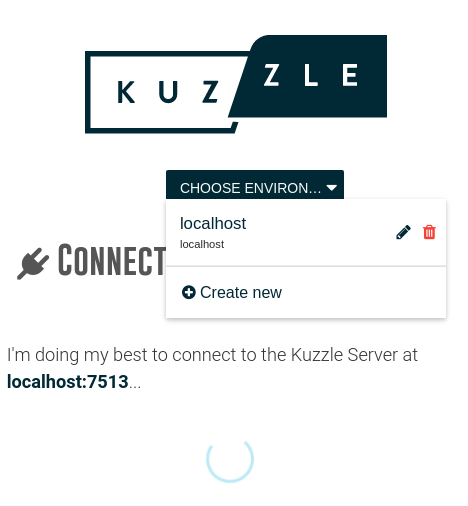
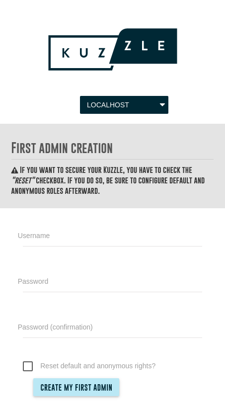

# Kuzzle Admin Console

The Kuzzle Admin Console is a web application that lets you manage Kuzzle, including **data**, **real-time notifications** and **security**.

If you don't want to install Kuzzle Admin Console yourself you can use our [pubicly hosted](http://console.kuzzle.io) Admin Console. Otherwise, grab the [source code](https://github.com/kuzzleio/kuzzle-admin-console) and install it on your  environment.

In both cases the configuration is the same and you'll be able to select which [Kuzzle](/core/2/guides/essentials/admin-console#connect-to-kuzzle) installation you want to manage.

:::info
Having trouble? Get in touch with us on [Discord](http://join.discord.kuzzle.io)!
:::

## Connect to Kuzzle

The Kuzzle Admin Console automatically searches for Kuzzle on `ws://localhost:7512` and prompts you to introduce your own host and port if it is unable to connect to that URL.

At any time, you can reconfigure the Kuzzle Admin Console to connect to any Kuzzle installation by clicking the **"Choose Environment"** dropdown menu and then selecting **"Create new"**. This feature allows you to manage multiple Kuzzle installations on a single Kuzzle Admin Console.

To create a connection to Kuzzle, provide its **name** (e.g. "Development" or "My First Kuzzle"), **address** (or hostname) and **port**. Optionally, select a **color** to identify the connection (e.g. red could be used to identify production environments).

:::success
Your Kuzzle Admin Console is now connected to Kuzzle.
:::

## Create an Admin Account

At this point Kuzzle is not secure and any `anonymous` user has full access. The Kuzzle Admin Console configurator will automatically request that an Admin Account be created. For the purpose of this tutorial, leave the **reset default and anonymous rights** unchecked, as we will use the `anonymous` account in the next steps.

Once the Admin Account credentials have been created, use them to login.

:::success
You can now manage Kuzzle via the Kuzzle Admin Console.
:::
