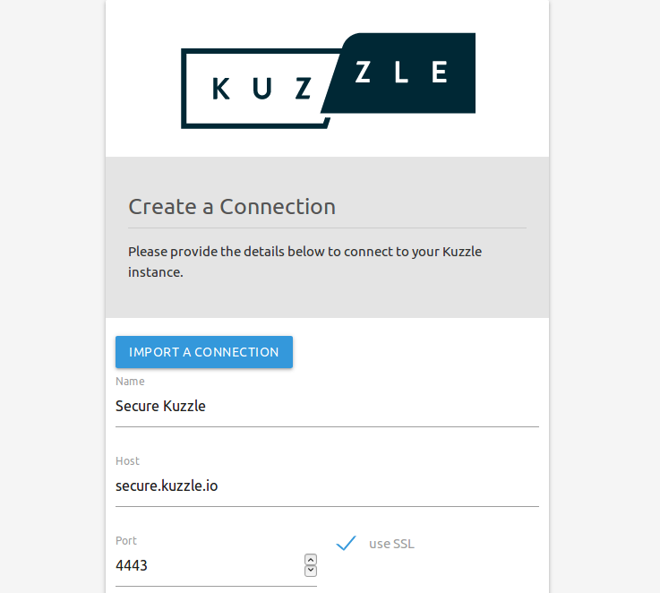

# SSL Support

::: info
This guide is inspired by this blog article: [https://blog.kuzzle.io/secure-kuzzle-nginx-and-ssl](https://blog.kuzzle.io/secure-kuzzle-nginx-and-ssl)
:::

It is possible to access Kuzzle securely with SSL.  
To do this it is necessary to use a reverse proxy to add the encryption layer.  

The purpose of this guide is to explain the steps necessary to secure all communications between Kuzzle and clients.  

::: info
This guide can be used in both production and development environments.
:::

## Kuzzle through SSL

The first step is to be able to communicate with the Kuzzle API through an SSL connection.  

### Get a certificate

First of all you need to obtain an SSL certificate for a domain. There are two ways to do this:
  - obtain a self-signed certificate (development only)
  - obtain a certificate issued by a certification authority

To obtain a self-signed certificate, you can follow the instructions given here: [https://www.selfsignedcertificate.com/](https://www.selfsignedcertificate.com)

To obtain a certificate from a third-party authority, you can use Certbot: [https://certbot.eff.org/](https://certbot.eff.org)

No matter how you get your certificate, at the end you must have two files: a `.crt` and a `.key`.

### Setup Nginx as reverse proxy

We will use Nginx as a reverse proxy to add the SSL encryption layer.  
This reverse proxy will listen for incoming connections on port `4443` and then send them to Kuzzle on port `7512`

After installing Nginx, we will create a `kuzzle.conf` file containing the reverse proxy configuration:

```
map $http_upgrade $connection_upgrade {           
  default upgrade;
  '' close;
}
                   
server {
  server_name api.kuzzle.io
  
  listen 4443 ssl;
                          
  proxy_read_timeout 3600s;
                                         
  ssl_certificate /path/to/your/ssl/cert/localhost.crt;
  ssl_certificate_key /path/to/your/ssl/key/localhost.key;
                                                 
  error_code 497 https://$host$request_uri;
             
  location / {
    proxy_pass http://localhost:7512;
    proxy_http_version 1.1;
    proxy_set_header Upgrade $http_upgrade;
    proxy_set_header Connection $connection_upgrade;
  }
}
```

::: info
The steps below are specific for debian like distribution.  
For other distribution, please refere to Nginx documentation.  
:::

This configuration file must be saved in the `/etc/nginx/site-available` folder, then to activate it it is necessary to create a symbolic link to the `/etc/nginx/site-enabled` folder:

```bash
ln -s /etc/nginx/site-available/kuzzle.conf /etc/nginx/site-enabled/kuzzle.conf
```

Then we reload the configuration of Nginx: `systemctl reload nginx.service`

Kuzzle can now be accessed using SSL, on port `4443`.

## Admin Console

The Admin Console uses a WebSocket connection to connect to the Kuzzle API.  
For security reasons, browsers will prevent you to connect to Kuzzle via SSL using an Admin Console instance served by a non-secured protocol.

For the Public Console Admin, simply access the HTTPS/SSL version of the console: [https://console.kuzzle.io](https://console.kuzzle.io)

For a self-hosted version, it is necessary to access the latter through an HTTPS/SSL connection.

When creating a new connection to Kuzzle, you must check the `Use SSL` box to enable SSL support.



## SDKs

All our SDKs also support secure connections to Kuzzle.  

Please refer to the corresponding [SDK documentation](/sdk).
