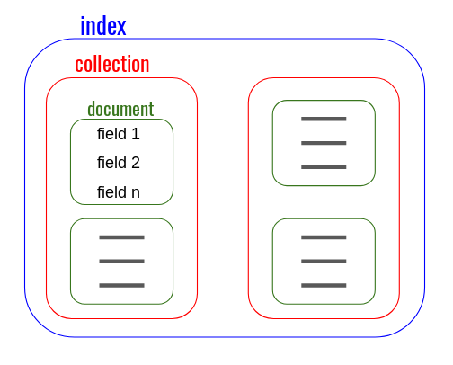

# Store and access data

Kuzzle uses [Elasticsearch](https://www.elastic.co/elastic-stack) as a document-oriented storage.  

All documents, including internal Kuzzle ones (such as security information), are stored in Elasticsearch indexes.  

Kuzzle's storage capabilities are therefore directly linked to Elasticsearch's capabilities and limits.  

## Data storage organization

Kuzzle organizes the data storage in 4 levels: 
  - indexes
  - collections
  - documents
  - fields

An index brings together several collections, which in turn contain several documents, each of which is composed of several fields.  


### Comparison with a relational database

Even if Elasticsearch is not, strictly speaking, a database, the way it stores data is very similar to that of document-oriented databases.  

If you're more familiar with the way relational databases store data, here is how it compares:

| Document-oriented storage | Relational databases storage |
| --------------------- | -------------- | 
| index | database | 
| collection | table |
| document | line |
| field | column |

*Note:* collections are specific to Kuzzle, this notion does not exist in Elasticsearch 

Comparing document-oriented storages with relational databases would require a more thorough analysis, but for the purposes of this guide, we shall reduce the list of differences to the following 3 items:
  - Documents are identified with a unique identifier, which is stored separately from the content of documents (compared to primary/foreign keys, stored alongside the data they identify),
  - no advanced join system,
  - a [typed mapping system](/core/2/guides/essentials/database-mappings#properties-types-definition) to define how Elasticsearch should index the fields.

All these differences should be taken into account when modeling your [data model](/core/2/guides/essentials/database-mappings) and your application.  

## Creating indexes and collections

The creation of indexes and collections is done through the API via the methods [index:create](/core/2/api/controllers/index/create) and [collection:create](/core/2/api/controllers/collection/create).  

For example, to create a `nyc-open-data` index:

```bash
curl -X POST localhost:7512/nyc-open-data/_create?pretty
```

<details><summary>Click to see Kuzzle API answer</summary>
<pre>
{
  "requestId": "e9ab8d1a-ea1a-4fdd-ad50-07c82245d88c",
  "status": 200,
  "error": null,
  "controller": "index",
  "action": "create",
  "collection": null,
  "index": "nyc-open-data",
  "volatile": null,
  "result": {
    "acknowledged": true,
  }
}
</pre>
</details>

Then a `yellow-taxi` collection in this index:

::: warning
It is recommended to specify a [data mapping](/core/2/guides/essentials/database-mappings) when creating a collection so that its content can correctly be indexed by Elasticsearch.
:::

```bash
curl -X PUT localhost:7512/nyc-open-data/yellow-taxi?pretty
```

<details><summary>Click to see Kuzzle API answer</summary>
<pre>
{
  "requestId": "1d5b7afe-9d81-4c0e-92bc-aa57b24c35eb",
  "status": 200,
  "error": null,
  "controller": "collection",
  "action": "create",
  "collection": "yellow-taxi",
  "index": "nyc-open-data",
  "volatile": null,
  "result": {
    "acknowledged": true
  }
}
</pre>
</details>

::: info
It is also possible to define in advance a set of indexes and collections, then load them at the start of Kuzzle (`bin/start-kuzzle-server --mappings mappings.json`) or with [Kourou](/core/2/guides/essentials/kourou-cli) `(kourou query admin:loadMappings < mappings.json`).
:::

## Writing documents

Kuzzle's API offers several methods to create, modify or delete documents in its storage space.  

There are two families of methods: those acting on a document and those acting on multiple documents.

Methods acting on a single document:
  - [document:create](/core/2/api/controllers/document/create): creates a new document
  - [document:createOrReplace](/core/2/api/controllers/document/create): creates a new document or replaces an existing one
  - [document:delete](/core/2/api/controllers/document/delete): deletes a document
  - [document:replace](/core/2/api/controllers/document/replace): replaces an existing document
  - [document:update](/core/2/api/controllers/document/update): updates fields in an existing document

Methods acting on multiple documents
  - [document:deleteByQuery](/core/2/api/controllers/document/delete-by-query): deletes documents matching an Elasticsearch query
  - [document:mCreate](/core/2/api/controllers/document/m-create): creates multiple documents
  - [document:mCreateOrReplace](/core/2/api/controllers/document/m-create-or-replace): creates or replaces multiple documents
  - [document:mDelete](/core/2/api/controllers/document/m-delete): deletes multiple documents
  - [document:mReplace](/core/2/api/controllers/document/m-replace): replaces multiple documents
  - [document:mUpdate](/core/2/api/controllers/document/m-update): updates fields of multiple documents

::: info 
The [bulk controller](/core/2/api/controllers/bulk) features low-level methods for mass  documents injection in collections.
:::

For example, to create a new document in our index:

```bash
curl -X POST -H "Content-Type: application/json" -d '{ "driver": "liia", "arriveAt": "2019-07-26"  }' http://localhost:7512/nyc-open-data/yellow-taxi/document-uniq-id/_create?pretty
```

<details><summary>Click to see Kuzzle's answer</summary>
<pre>
{
  "requestId": "e146e2a5-ff5b-4b6f-a603-8cde43f353fe",
  "status": 200,
  "error": null,
  "controller": "document",
  "action": "create",
  "collection": "yellow-taxi",
  "index": "nyc-open-data",
  "volatile": null,
  "result": {
    "_index": "nyc-open-data",
    "_type": "yellow-taxi",
    "_id": "document-uniq-id", // Document ID
    "_version": 1,
    "result": "created",
    "created": true,
    "_source": {                   // Document body
      "driver": "liia",
      "arriveAt": "2019-07-26",
      "_kuzzle_info": {            // Kuzzle metadata
        "author": "-1",
        "createdAt": 1561443009768,
        "updatedAt": null,
        "updater": null
      }
    }
  }
}
</pre>
</details>

Using the [document:update](/core/2/api/controllers/document/update) method allows us to add a new field while keeping the old ones:

```bash
curl -X PUT -H "Content-Type: application/json" -d '{ "car": "rickshaw"  }' http://localhost:7512/nyc-open-data/yellow-taxi/document-uniq-id/_update?pretty
```

<details><summary>Click to see Kuzzle's answer</summary>
<pre>
{
  "requestId": "1be6c9e6-2626-4f85-ad64-d1cc248c7bee",
  "status": 200,
  "error": null,
  "controller": "document",
  "action": "update",
  "collection": "yellow-taxi",
  "index": "nyc-open-data",
  "volatile": null,
  "result": {
    "_index": "nyc-open-data",
    "_type": "yellow-taxi",
    "_id": "document-uniq-id",
    "_version": 2,
    "result": "updated"
  }
}
</pre>
</details>

## Reading documents

There are two ways to retrieve documents:
  - using the document unique identifiers,
  - by performing a search with an Elasticsearch query.

### Getting documents

To retrieve a document when you know its unique identifier, you have to use the [document:get](/core/2/api/controllers/document/get) or the [document:mGet](/core/2/api/controllers/document/m-get) method.

For example, to retrieve the documents we created in the previous examples:

```bash
curl http://localhost:7512/nyc-open-data/yellow-taxi/document-uniq-id?pretty
```

<details><summary>Click to see Kuzzle's answer</summary>
<pre>
{
  "requestId": "62af64c8-5dc6-48c1-942b-2604bf97686e",
  "status": 200,
  "error": null,
  "controller": "document",
  "action": "get",
  "collection": "yellow-taxi",
  "index": "nyc-open-data",
  "volatile": null,
  "result": {
    "_index": "nyc-open-data",
    "_type": "yellow-taxi",
    "_id": "document-uniq-id",
    "_version": 2,
    "found": true,
    "_source": {
      "driver": "liia",
      "arriveAt": "2019-07-26",
      "_kuzzle_info": {
        "author": "-1",
        "createdAt": 1561443222474,
        "updatedAt": 1561443279526,
        "updater": "-1"
      },
      "car": "rickshaw"
    }
  }
}
</pre>
</details>

### Searching documents

Searching documents is performed using the [Elasticsearch Query DSL](https://www.elastic.co/guide/en/elasticsearch/reference/7.4/query-dsl.html).  
As Elasticsearch is an indexing engine designed for document search, it offers a wide range of advanced search options like [geo queries](https://www.elastic.co/guide/en/elasticsearch/reference/7.4/geo-queries.html), [full text queries](https://www.elastic.co/guide/en/elasticsearch/reference/7.4/full-text-queries.html), [aggregations](https://www.elastic.co/guide/en/elasticsearch/reference/7.4/search-aggregations.html), and more.  

Requests must be made through Kuzzle using the [document:search](/core/2/api/controllers/document/search) method.

::: warning
When a document is created or modified, its latest version is not immediately available in the results of a search.  
First, you have to wait until Elasticsearch has finished updating its index.  
It is possible to make Elasticsearch wait for the indexation before sending the answer by setting `refresh=wait_for`.
::: 

For example, to retrieve documents between the ages of 25 and 28:

```bash
# First create some documents
for i in {18..42}; do; curl -X POST -H "Content-Type: application/json" -d "{ \"driver\": \"driver-$i\", \"age\": $i  }" http://localhost:7512/nyc-open-data/yellow-taxi/_create &; sleep 0.05; done

# Search for drivers between 25 and 28 years
curl -X POST -H "Content-Type: application/json" -d '{ 
  "query": { 
    "range": { 
      "age": { "gte": 25, "lte": 28 } 
    } 
  }  
}
' http://localhost:7512/nyc-open-data/yellow-taxi/_search?pretty

```

<details><summary>Click to see Kuzzle's answer</summary>
<pre>
{
  "requestId": "836768a4-0b46-447a-b4c5-8932101f24de",
  "status": 200,
  "error": null,
  "controller": "document",
  "action": "search",
  "collection": "yellow-taxi",
  "index": "nyc-open-data",
  "volatile": null,
  "result": {
    "took": 12,
    "timed_out": false,
    "hits": [
      {
        "_index": "nyc-open-data",
        "_type": "yellow-taxi",
        "_id": "AWuNXWff6MDMyQmSeEuT",
        "_score": 1,
        "_source": {
          "driver": "driver-27",
          "age": 27,
          "_kuzzle_info": {
            "author": "-1",
            "createdAt": 1561444837342,
            "updatedAt": null,
            "updater": null
          }
        }
      },
      {
        "_index": "nyc-open-data",
        "_type": "yellow-taxi",
        "_id": "AWuNXWd46MDMyQmSeEuR",
        "_score": 1,
        "_source": {
          "driver": "driver-25",
          "age": 25,
          "_kuzzle_info": {
            "author": "-1",
            "createdAt": 1561444837239,
            "updatedAt": null,
            "updater": null
          }
        }
      },
      {
        "_index": "nyc-open-data",
        "_type": "yellow-taxi",
        "_id": "AWuNXWgQ6MDMyQmSeEuU",
        "_score": 1,
        "_source": {
          "driver": "driver-28",
          "age": 28,
          "_kuzzle_info": {
            "author": "-1",
            "createdAt": 1561444837391,
            "updatedAt": null,
            "updater": null
          }
        }
      },
      {
        "_index": "nyc-open-data",
        "_type": "yellow-taxi",
        "_id": "AWuNXWer6MDMyQmSeEuS",
        "_score": 1,
        "_source": {
          "driver": "driver-26",
          "age": 26,
          "_kuzzle_info": {
            "author": "-1",
            "createdAt": 1561444837290,
            "updatedAt": null,
            "updater": null
          }
        }
      }
    ],
    "total": 4,
    "max_score": 1
  }
}
</pre>
</details>

## Kuzzle indexes in Elasticseach

Elasticsearch indexes created and managed by Kuzzle follow this naming convention:

 - private indexes: `%<index name>.<collection name>` (Kuzzle internal data, plugins dedicated storage)
 - public indexes: `&<index name>.<collection name>`

::: warning
Indexes not following this naming policy cannot be accessed by Kuzzle's API.  
Create an Elasticsearch alias to share a regular index with Kuzzle (and vice-versa).
:::

## What Now?

- Exploit the full capabilites of Elasticsearch with [Data Mappings](/core/2/guides/essentials/database-mappings)
- Read our [Elasticsearch Cookbook](/core/2/guides/cookbooks/elasticsearch) to learn more about how querying works in Kuzzle
- Use [document metadata](/core/2/guides/essentials/document-metadata) to find or recover documents
- Keep track of data changes using [Real-time Notifications](/core/2/guides/essentials/real-time)
