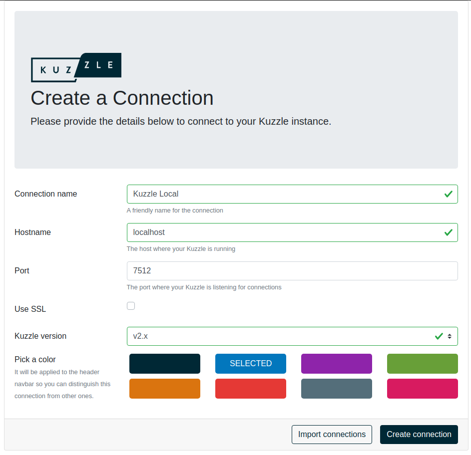

# Run Kuzzle

Kuzzle is a Node.js application that can be installed on a large number of environments.

It only requires two services: [Elasticsearch](https://www.elastic.co/what-is/elasticsearch) and [Redis](https://redis.io/topics/introduction).

In this guide we will use Docker and Docker Compose to run those services.

### Prerequisites

 - [Node.js >= 12](https://nodejs.org/en/download/)
 - [Docker](https://docs.docker.com/engine/install/)
 - [Docker Compose](https://docs.docker.com/compose/install/)
 - [Kourou](https://github.com/kuzzleio/kourou)
 - Compile toolchain: a C++ compiler (g++, clang, ...), make and python

Throughout this guide, we will need to use [Kourou](https://github.com/kuzzleio/kourou), the Kuzzle CLI.

You can install Kourou globally by using NPM: `npm install -g kourou`

::: warning
Kuzzle use compiled C++ dependencies so a compile toolchain (a C++ compiler like g++ or clang, make and python) is necessary to run `npm install kuzzle`.  
For the sack of simplicity we will use a Docker and Docker Compose throughout this guide.  
If you want to run Kuzzle directly from you computer, you can check out the [Installing and Running](/core/2/guides/advanced/4-installing-and-running) guide.
::: 

### Let's go!

First, we will initialize a new application using Kourou:

```bash
$ kourou app:scaffold playground
 
  🚀 Kourou - Scaffolds a new Kuzzle application
 
  ✔ Creating "playground/" directory
  ✔ Creating and rendering application files
  ✔ Installing latest Kuzzle version via NPM and Docker (this can take some time)

 [✔] Scaffolding complete! Use "npm run dev:docker" to run your application

```

This will create the following files and directories:

```
playground/
├── lib                  < application code
├── .eslintignore
├── .eslintrc.json
├── .gitignore
├── .kuzzlerc            < kuzzle configuration file
├── app.ts               < application entrypoint        
├── docker-compose.yml   < Docker Compose configuration
├── .mocharc.json
├── package.json
├── package-lock.json
├── README.md
└── tsconfig.json
```

The `app.ts` file contain the basic code to run a Kuzzle application. This file is meant to be executed with Node.js as any application.

```ts
import { Backend } from 'kuzzle'

const app = new Backend('playground')

app.start()
  .then(() => {
    app.log.info('Application started')
  })
  .catch(console.error)
```

We can now run our first application with `npm run dev:docker`

::: info
Under the hood, the command `npm run dev:docker` uses [nodemon](https://nodemon.io/) and [ts-node](https://www.npmjs.com/package/ts-node) inside the Docker container to run the application.
:::

Now visit [http://localhost:7512](http://localhost:7512) with your browser. You should see the result of the [server:info](/core/2/api/controllers/server/info) action.

### Admin Console

We can also use the [Admin Console](/core/2/some-page-about-ac) which allows to manage your data, your users and your rights.

::: info
The Admin Console is a [Single Page Application](https://en.wikipedia.org/wiki/Single-page_application) written in Vue.js and using the [Javascript SDK](/sdk/js/7).  
No data related to your connection to Kuzzle will pass through our servers.
:::

First, we need to setup a new connection to a Kuzzle application. Open the [Admin Console](http://next-console.kuzzle.io) in your browser and then fill the form as follow:



Click on `Create Connection` and then select your connection on the dropdown menu.

When asked for credentials, just choose `Login as Anonymous`.

You are now connected to your local Kuzzle application with the Admin Console! Everything is empty but we are gonna change that in the next section.

<GuidesLinks 
  :next="{ text: 'Store and Access Data', url: '/core/2/guides/getting-started/2-store-and-access-data/' }"
/>
