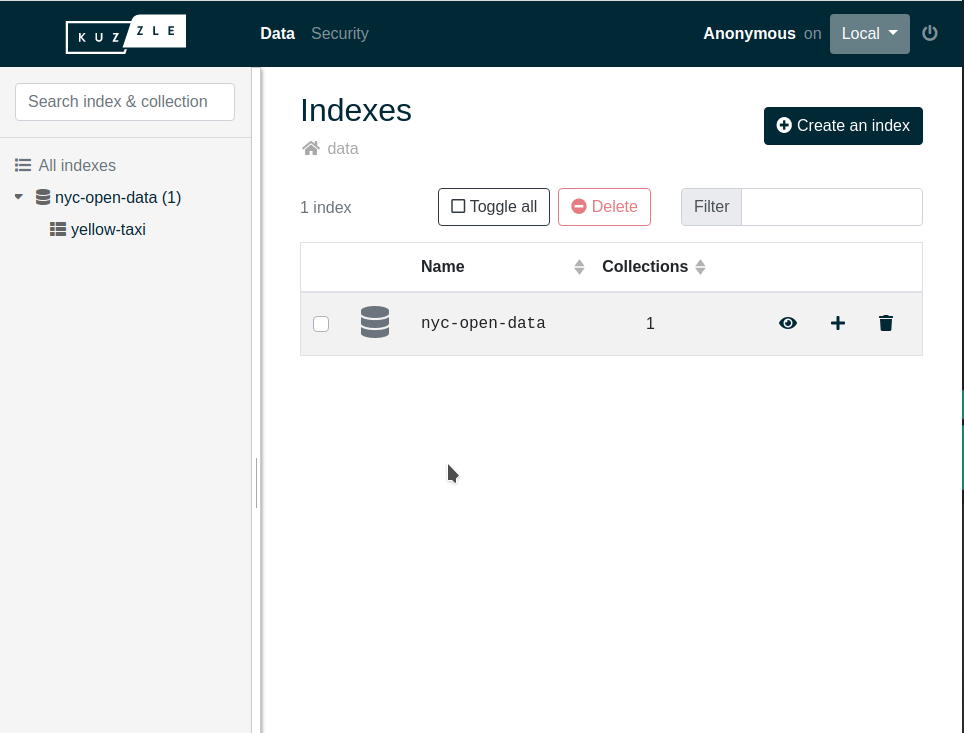

# Storing Data

Now that Kuzzle is running, we are going to create some documents.

Kuzzle organizes the data storage in 4 levels: 
  - indexes
  - collections
  - documents
  - fields

An index brings together several collections, which in turn contain several documents, each of which is composed of several fields.

The collections have mappings that characterize the way Elasticsearch will index the data for the search.

::: info
It is recommended that you define your own mappings in order to specify the desired types for your collections and avoid default types that may be imprecise.
:::

If you're more familiar with the way relational databases store data, here is how it compares:

| Document-oriented storage | Relational databases storage |
| --------------------- | -------------- | 
| index | database | 
| collection | table |
| document | line |
| field | column |

First, we are gonna create an index with Kourou: `kourou index:create nyc-open-data`

Then, we are gonna create a collection inside this index. We will provide the following basic mappings:

```js
{
  properties: {
    name: { type: "keyword" },
    age: { type: "integer" }
  }
}
```

Run the following command to create our `yellow-taxi` collection: 

```bash
$ kourou collection:create nyc-open-data yellow-taxi '{
  properties: {
    name: { type: "keyword" },
    age: { type: "integer" }
  }
}'
```

Now we have a collection ready to receive documents, again use Kourou to create one:

```bash
$ kourou document:create nyc-open-data yellow-taxi '{
  name: "Yagmur",
  age: 27
}'
```

Finally, we are going to use the admin console to look at what we have created.

Open [http://console.kuzzle.io](http://console.kuzzle.io) in your browser.


