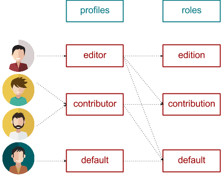
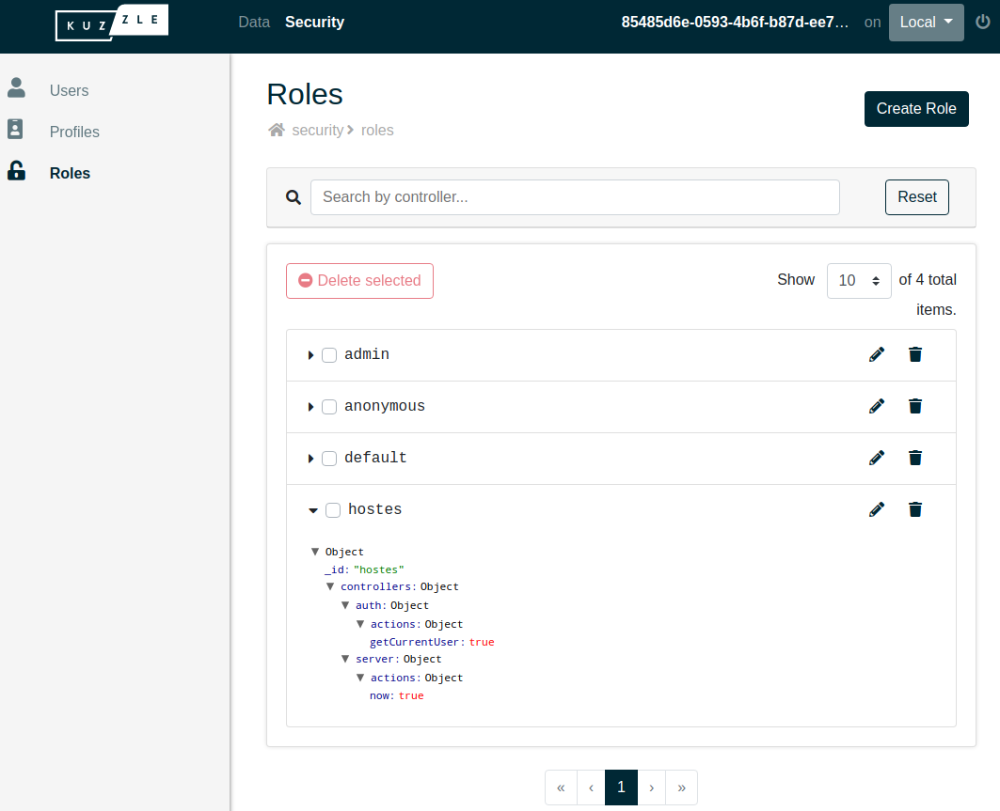
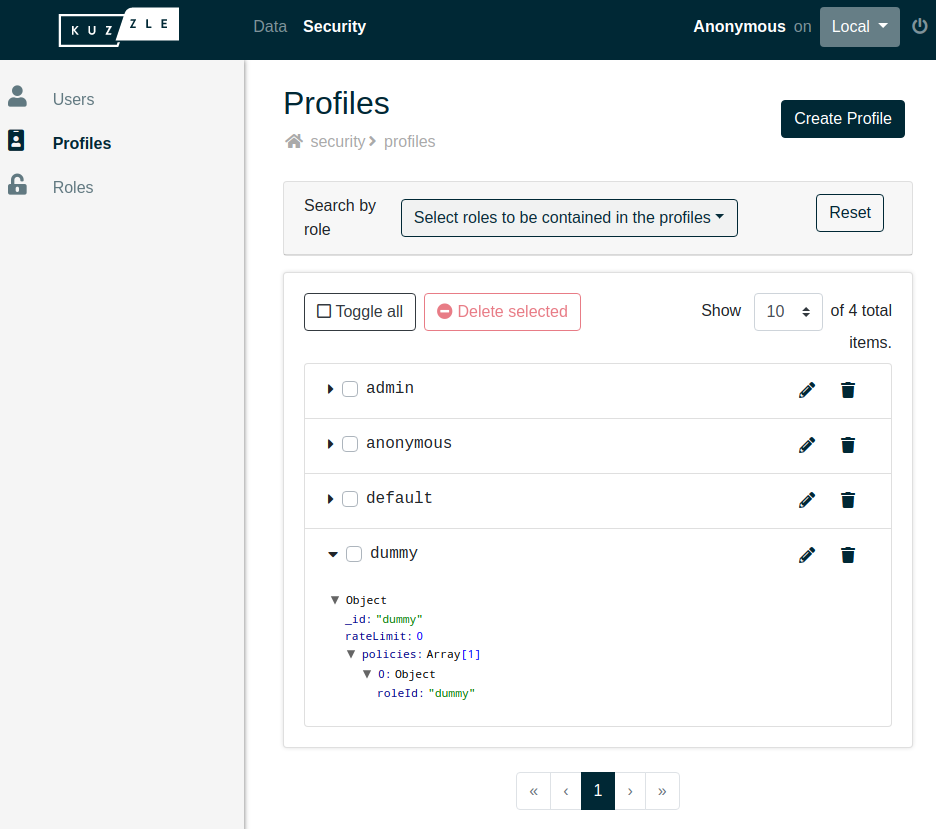
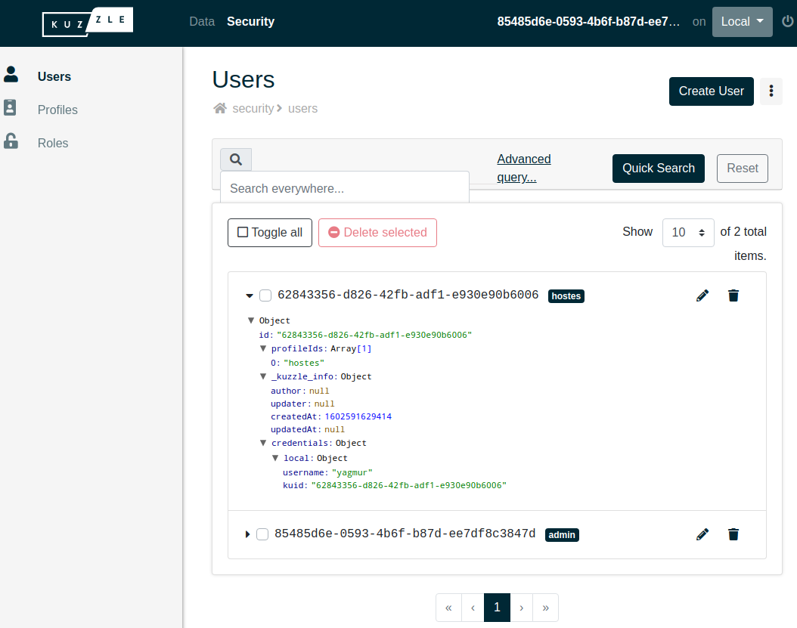

# Access Control Rights

As in any backend, Kuzzle allows you to restrict access to its functionalities according to the users.

The permissions system is designed following a standard model and is structured in 3 dimensions:
 - **role**: whitelist authorized API actions
 - **profile**: combination of one or more roles
 - **user**: combination of one or more profiles



See the [in-depth guide](/core/2/guides/some-link-for-acl-in-depth) for more details.

### Create our first restricted user

#### Role

First, we are gonna create a new role with the [security:createRole](/core/2/api/controllers/security/create-role) action.

The following role description give access to [auth:getCurrentUser](/core/2/api/controllers/auth/get-current-user) and [server:info](/core/2/api/controllers/auth/get-current-user) actions only.

```js
{
  controllers: {
    auth: {
      actions: {
        getCurrentUser: true
      }
    },
    server: {
      actions: {
        now: true
      }
    }
  }
}
```

Copy the above role and then run this command: `kourou security:createRole --id hostes --body-editor`

A text editor should open itself, replace the existing body by our role definition and then exit the editor.

::: info
If you have trouble with the integrated text editor, you can try to run the command directly as well:  

```bash
$ kourou security:createRole '{
  controllers: {
    auth: {
      actions: {
        getCurrentUser: true
      }
    },
    server: {
      actions: {
        now: true
      }
    }
  }
}' --id hostes
```
:::

You should see your newly created role in the `Security > Roles` section of the [Admin Console](http://console.kuzzle.io)



#### Profile

Then, we are gonna create a profile who use our newly created role. For this we will use the [security:createProfile](/core/2/api/controllers/security/create-profile) action.

```bash
$ kourou security:createProfile '{
  policies: [
    { roleId: "hostes" }
  ]
}' --id hostes
```

Now we have a `hostes` profile which give access to the `hostes` role actions.

You should see your newly created profile in the `Security > Profiles` section of the [Admin Console](http://console.kuzzle.io)



#### User

Finally, we need an user that use the `hostes` profile. The API action to create an user is [security:createUser](/core/2/api/controllers/security/create-user).

User need at least to be assigned with one profile. Also we are gonna give our user some credentials to be able to log in.

```bash
$ kourou security:createUser '{
  content: {
    profileIds: ["hostes"]
  },
  credentials: {
    local: {
      username: "yagmur",
      password: "password"
    }
  }
}'
```

You should see your newly created role in the `Security > Users` section of the [Admin Console](http://console.kuzzle.io)



### Creates administrator and restrict anonymous user rights

When you are not authenticated, your request are executed as the `anonymous` user.

Like every other user, this user is assigned with a profile (`anonymous`) and thus a role (`anonymous` as well).

::: info
By default, the `anonymous` role give access to every API actions. This is intended to makes development easier but it's definitively not suitable for production.
:::

It's recommanded to use the [security:createFirstAdmin](/core/2/api/controllers/security/create-first-admin) action to creates an admin and restrict anonymous user rights.

::: info
The [security:createFirstAdmin](/core/2/api/controllers/security/create-first-admin) creates an user which have the `admin` profile and this the `admin` role who give access to every API actions.
:::

In this way you can always access the complete API throught this admin account.

```bash
$ kourou security:createFirstAdmin '{
  credentials: {
    local: {
      username: "admin",
      password: "password"
    }
  }
}' -a reset=true
```

#### Try the API as anonymous user

Try to run the following command: `kourou server:now`

You should get the following error because since the anonymous user is now restricted to only a few API actions:

```bash
$ kourou server:now

[ℹ] Unknown command "server:now", fallback to API method
 
 🚀 Kourou - Executes an API query.
 
 [ℹ] Connecting to http://localhost:7512 ...
 [X] UnauthorizedError: Unauthorized: authentication required to execute the action "server:now". -1
    [...Kuzzle internal calls deleted...]
    at Funnel.checkRights (/var/app/lib/api/funnel.js:374:28)
        status: 401
        id: security.rights.unauthorized
```

#### Try the API as authentified user

Run the same command but authenticate with the user we just create: `kourou server:now --username yagmur --password password`

We have the right to use this API action because we are now authenticated.

```bash
$ kourou server:now --username yagmur --password password

[ℹ] Unknown command "server:now", fallback to API method
 
 🚀 Kourou - Executes an API query.
 
 [ℹ] Connecting to http://localhost:7512 ...
 [ℹ] Loggued as yagmur.
 {
  "now": 1602591681683
}
 [✔] Successfully executed "server:now"
```