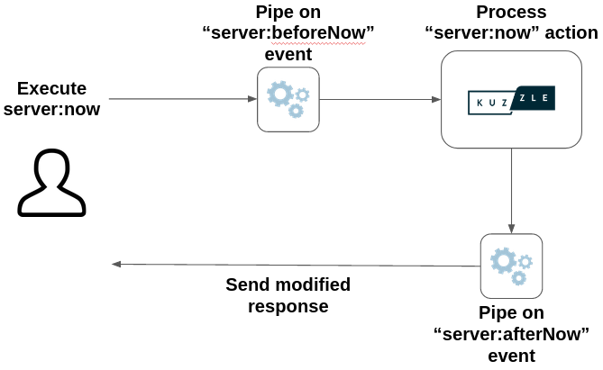

# Modify API behavior

Kuzzle allows to modify API action behavior with a very precise middleware-like system.  

This system makes it possible to modify the execution flow of requests processed by Kuzzle.

## Events

Each time a request is executed, Kuzzle will emit several events in order to be able to influence the life cycle of the request processing.

There is many different events available, you can see the complete list here: [Kuzzle events](/core/2/api/some-link).

### API events

The most frequently used events are those identifying the API action that has been executed. Kuzzle will emit one event before it starts processing the action and one event before sending back the response.

The format of those events is the following:
 - `<controller>:before<Action>`: emitted before processing
 - `<controller>:after<action>`: emitted after processing, before sending back the response

Restarts your application with the following command to display events: `DEBUG=kuzzle:events npm run dev`

::: info
Kuzzle use the [debug](https://www.npmjs.com/package/debug) package to display messages.  
Learn more about debug message in the [Debugging Kuzzle](/core/2/debugging) guide.
:::

Then execute the `server:now` action with Kourou: `kourou server:now`

You should see the following lines in your first terminal:
```bash
  [...]

  kuzzle:events Triggering pipe "server:beforeNow" with payload: [ Request { /* ... */ } ] +0ms

  kuzzle:events Triggering pipe "server:afterNow" with payload: [ Request { /* ... */ } ] +1ms

  [...]
```

::: warning
Kuzzle emit many other event during request processing.

Be careful to only use documented events. Some events are for internal use and are subject to change.
:::

## Plug into events with Pipes

Pipes are functions plugged to events, called synchronously by Kuzzle, and receiving information regarding that event.

Pipes can:
  - Decide to abort a task. If a pipe throws an error, Kuzzle interrupts the task, and forwards a standardized version of the thrown error to the originating user
  - Change the received information. Kuzzle will use the updated information upon resuming the task



Each event carry a different payload. This payload must be returned in the pipe function so Kuzzle can continue its execution process.

### Register a pipe

We need to use the [Backend.pipe.register](/core/2/some-link) method to register new pipes. This method takes an event name as first parameter and the pipe handler function.

In this example, we are going to change the return value of the `server:now` action to return date string instead of an UNIX timestamp:

```js
app.pipe.register('server:afterNow', async request => {
  request.result.now = (new Date()).toUTCString()

  return request
})
```

::: info
You can register several pipe on the same action, Kuzzle will execute them sequentially.  
However since it's not possible to ensure pipes execution order,  applications should not rely on it.
:::

Now we can call the action with Kourou:

```bash
$ kourou server:now

[ℹ] Unknown command "server:now", fallback to API method
 
 🚀 Kourou - Executes an API query.
 
 [ℹ] Connecting to http://localhost:7512 ...
 {
  "now": "Thu, 15 Oct 2020 14:15:27 GMT"
 }
 [✔] Successfully executed "server:now
```

Learn more about:
 - [Kuzzle events](/core/2/api/some-links)
 - [Pipe and hooks](/core/2/guides/some-link)