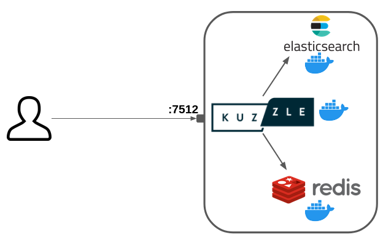

# Deploy your Application

Kuzzle is just a Node.js application that also needs [Elasticsearch](https://www.elastic.co/what-is/elasticsearch) and [Redis](https://redis.io/topics/introduction) to run.  

The only specifity is that **Kuzzle needs to compile C and C++ dependencies** so a successful `npm install` execution needs the `python` and `make` packages, as well as C and C++ compilers (in the following examples we'll use `g++`).   

At Kuzzle we like to use Docker and Docker Compose to quickly deploy applications.  
In this guide we will see how to deploy a Kuzzle application on a remote server.

**Prerequisites:**
  - A SSH access to a remote server running on Linux
  - [Docker](https://docs.docker.com/engine/install/) and [Docker Compose](https://docs.docker.com/compose/install/) installed on this server
  - A Kuzzle application

::: info
In this guide we will perform a basic deployment of a Kuzzle application.  
For production deployments, we strongly recommend to deploy your application in [cluster mode](/core/2/guides/advanced/cluster-scalability) to take advantage of high availability and scalability.  
Our team can bring its expertise and support for such deployments: [get a quote](https://info.kuzzle.io/contact-us)
:::

## Target architecture

We will deploy the following services in Docker containers:
 - Node.js (Kuzzle)
 - Elasticsearch
 - Redis

We will use Docker Compose as a basic container orchestrator.

Only Kuzzle will be exposed to the internet on the port 7512.



::: warning
This deployment does not use any SSL encryption (HTTPS).  
A production deployment must include a reverse proxy to securize the connection with SSL.
:::

::: warning
#### Production Deployment: Auth Token Secret

For every production deployment of Kuzzle, it is essential to set the kuzzle_security__authToken__secret environment variable. This ensures that the JWT secrets used for authenticating requests are generated externally and not stored in Elasticsearch. By managing the secret through an environment variable, you enhance security, prevent potential data exposure, and ensure tokens remain valid only as long as the secret remains unchanged.

Important: If the `kuzzle_security__authToken__secret` value is changed when Kuzzle restarts, all existing tokens will be invalidated. This ensures that only tokens signed with the current secret remain valid, adding an extra layer of security.

For default configuration values, you can refer to [the sample Kuzzle configuration file](https://github.com/kuzzleio/kuzzle/blob/master/.kuzzlerc.sample.jsonc).

Note: If the secret is not set, Kuzzle will fallback to a less secure method of generating and storing the secret, which is not recommended for production environments.
:::

## Prepare our Docker Compose deployment

We are going to write a `docker-compose.yml` file that describes our services.  

First, create a `deployment/` directory: `mkdir deployment/`

Then create the `deployment/docker-compose.yml` file and paste the following content:

```yaml
---
version: "3"

services:
  kuzzle:
    build:
      context: ../
      dockerfile: deployment/kuzzle.dockerfile
    command: node /var/app/app.js
    restart: always
    container_name: kuzzle
    ports:
      - "7512:7512"
      - "1883:1883"
    depends_on:
      - redis
      - elasticsearch
    environment:
      - kuzzle_services__storageEngine__client__node=http://elasticsearch:9200
      - kuzzle_services__internalCache__node__host=redis
      - kuzzle_services__memoryStorage__node__host=redis
      - NODE_ENV=production

  redis:
    image: redis:6
    command: redis-server --appendonly yes
    restart: always
    volumes:
      - redis-data:/data

  elasticsearch:
    image: kuzzleio/elasticsearch:7
    restart: always
    ulimits:
      nofile: 65536
    volumes:
      - es-data:/usr/share/elasticsearch/data

volumes:
  es-data:
    driver: local
  redis-data:
    driver: local
```

This configuration allows to run a Kuzzle application with Node.js alongside Elasticsearch and Redis.

Kuzzle needs compiled dependencies for the cluster and the realtime engine.  

We are going to use a [multi-stage Dockerfile](https://docs.docker.com/develop/develop-images/multistage-build/) to build the dependencies and then use the [node:12-stretch-slim](https://hub.docker.com/_/node?tab=description) image to run the application.

Create the `deployment/kuzzle.dockerfile` file with the following content:

```dockerfile
# builder image
FROM node:18 as builder

RUN  set -x \
  && apt-get update && apt-get install -y \
       curl \
       python \
       make \
       g++ \
       libzmq3-dev

ADD . /var/app

WORKDIR /var/app

RUN  npm ci && npm run build && npm prune --production

# run image
FROM node:18

COPY --from=builder /var/app /var/app

```

## Deploy on your remote server

Now we are going to use `scp` (SSH copy) to copy our application on the remote server.  

```bash
$ scp -r ../playground <user>@<server-ip>:.
```

Then simply connect to your server and run your application with Docker Compose:

```bash
$ ssh <user>@<server-ip>

[...]

$ docker compose -f deployment/docker-compose.yml up -d
```

Your Kuzzle application is now up and running on port 7512!

<GuidesLinks 
  :prev="{ text: 'Customize API Behavior', url: '/guides/getting-started/customize-api-behavior/' }" 
/>
