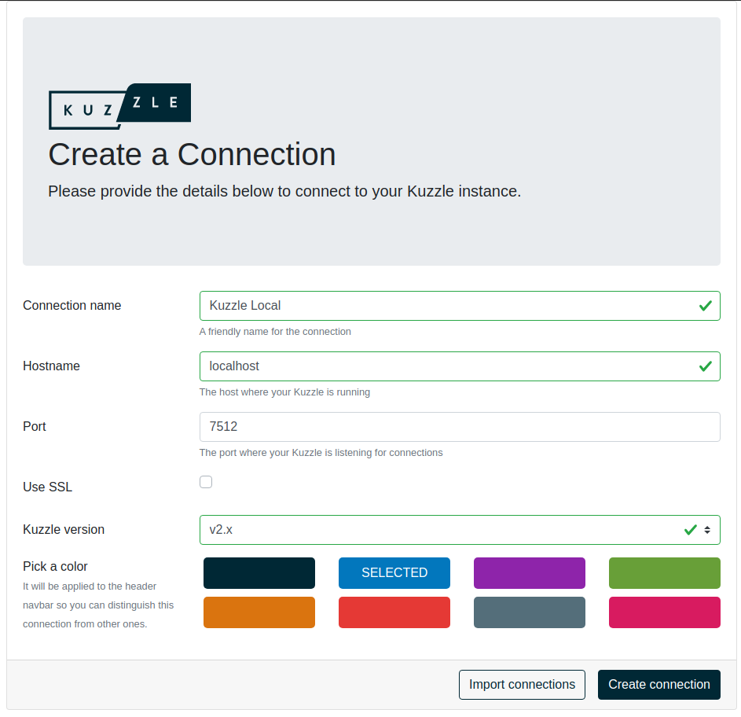
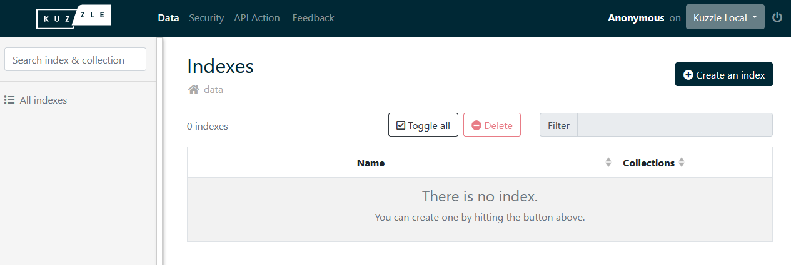

# Run Kuzzle

Kuzzle is a Node.js application that can be installed on a large number of environments.

It only requires two services: [Elasticsearch](https://www.elastic.co/what-is/elasticsearch) and [Redis](https://redis.io/topics/introduction).

In this guide we will use Docker and Docker Compose to run those services.

### Prerequisites

::: info
It is recommended to use Node Version Manager to avoid rights problems when using Node.js and dependencies.
You can install NVM with the one-liner script documented on [NVM Github repository](https://github.com/nvm-sh/nvm#install--update-script)
:::

- [Node.js <= 18](https://nodejs.org/en/download/)
- [Docker](https://docs.docker.com/engine/install/)
- [Docker Compose](https://docs.docker.com/compose/install/)
- [Kourou](https://github.com/kuzzleio/kourou)


Throughout this guide, we will need to use [Kourou](https://github.com/kuzzleio/kourou), the Kuzzle CLI.

You can install Kourou globally by using NPM: `npm install -g kourou`

::: warning
Kuzzle uses compiled C++ dependencies so a compile toolchain (a C++ compiler like g++ or clang, make and python) is necessary to run `npm install kuzzle`.
For the sake of simplicity we will use a Docker and Docker Compose throughout this guide.
:::

::: info
If you encounter issues about permissions when trying to use Docker, please follow the [Docker as a non root user guide](https://docs.docker.com/engine/install/linux-postinstall/#manage-docker-as-a-non-root-user).
:::

### Let's go!

First, we will initialize a new application using Kourou:

```bash
kourou app:scaffold playground

 🚀 Kourou - Scaffolds a new Kuzzle application

generic
  ✔ Checking destination
  ✔ Prepare temporary folder
  ✔ Cloning template repository
  ✔ Copying template files
  ✔ Cleaning up

 [✔] Scaffolding complete!
 [✔] Use cd playground && docker compose up -d to start your Kuzzle stack.
```

This will create the following files and directories:

```
.
├── Dockerfile
├── README.md
├── app.ts
├── docker-compose.yml
├── environments
│   ├── local
│   │   ├── kourou.env
│   │   └── kuzzlerc
│   └── main
│       ├── kourou.env
│       └── kuzzlerc
├── ergol.config.json
├── jest.config.ts
├── lib
│   ├── MyApplication.ts
│   └── modules
│       └── index.ts
├── package-lock.json
├── package.json
├── start.sh
├── tests
│   └── unit
│       ├── MyApplication.test.ts
│       └── utils.ts
└── tsconfig.json
```

The `app.ts` file contains the basic code to run a Kuzzle application. This file is meant to be executed with Node.js like any other app.

```ts
import { Backend } from "kuzzle";

const app = new Backend("playground");

app
  .start()
  .then(() => {
    app.log.info("Application started");
  })
  .catch(console.error);
```

::: info
You can now run `cd playground && docker compose up -d` to start your application.
:::

Now visit [http://localhost:7512](http://localhost:7512) with your browser. You should see the result of the [server:info](/core/2/api/controllers/server/info) action.

### Admin Console

You can also use the [Admin Console](https://next-console.kuzzle.io) which allows you to manage your data, your users and your rights.

::: info
The Admin Console is a [Single Page Application](https://en.wikipedia.org/wiki/Single-page_application) written in Vue.js and using the [Javascript SDK](/sdk/js/7).
No data related to your connection to Kuzzle will pass through our servers.
:::

First, we need to setup a new connection to a Kuzzle application. Open the [Admin Console](http://next-console.kuzzle.io) in your browser and then fill the form as follows:



Click on `Create Connection`, then select your connection on the dropdown menu.

When asked for credentials, just choose `Login as Anonymous`.

You are now connected to your local Kuzzle application using the Admin Console! Right now you can see that it is devoid of any data or configuration, but we are going to change that in the next section of this guide. 



::: info
The minimum rights required for an user to connect to the Kuzzle Admin Console are:

```js
{
  "controllers": {
    "auth": {
      "actions": {
        "login": true,
        "checkToken": true,
        "getCurrentUser": true,
        "getMyRights": true
      }
    }
  }
}
```

:::

<GuidesLinks
  :next="{ text: 'Store and Access Data', url: '/guides/getting-started/store-and-access-data/' }"
/>
