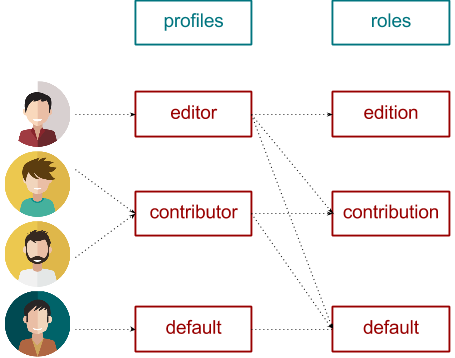
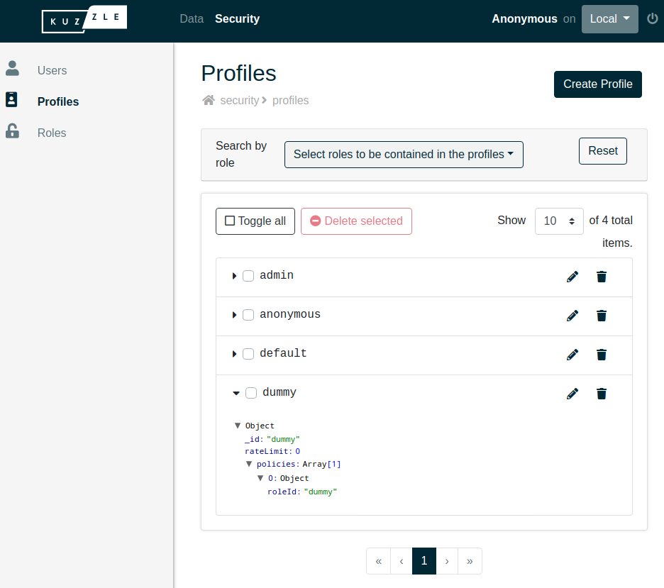

# Set up Permissions

As in any backend, Kuzzle allows you to **restrict access to its features and data**, depending on the querying users.

The permissions system is designed following a standard model and is structured in 3 dimensions:

- **role**: whitelist of allowed API actions
- **profile**: combination of one or more roles
- **user**: combination of one or more profiles



## Role

First, we are going to create a new role with the [security:createRole](/core/2/api/controllers/security/create-role) action.

The following role description gives access to [auth:getCurrentUser](/core/2/api/controllers/auth/get-current-user) and to the [server:info](/core/2/api/controllers/auth/get-current-user) actions only.

#### Using the API

```bash
curl -XPOST http://localhost:7512/roles/dummyRole/_create \
  -H 'Content-Type: application/json'\
  -d '{
  "controllers": {
    "auth": {
      "actions": {
        "getCurrentUser": true
      }
    },
    "server": {
      "actions": {
        "now": true
      }
    }
  }
}'

## Reponse
{
  "action": "createRole",
  "controller": "security",
  "error": null,
  "headers": {},
  "node": "knode-debonair-sappho-15470",
  "requestId": "539e4a0f-52ad-4a16-bf93-b894261bfbfa",
  "result": {
    "_id": "dummyRale",
    "_source": {
      "controllers": {
        "auth": {
          "actions": {
            "getCurrentUser": true
          }
        },
        "server": {
          "actions": {
            "now": true
          }
        }
      },
      "_kuzzle_info": {
        "author": null,
        "createdAt": 1729759668310,
        "updatedAt": null,
        "updater": null
      }
    }
  },
  "status": 200,
  "volatile": null
}
```

#### Using the CLI

```bash
kourou security:createRole '{
  controllers: {
    auth: {
      actions: {
        getCurrentUser: true
      }
    },
    server: {
      actions: {
        now: true
      }
    }
  }
}' --id dummyRole

## Response

[ℹ] Unknown command "security:createRole", fallback to API action

 🚀 Kourou - Executes an API query.

 [ℹ] Connecting to ws://localhost:7512 ...
{
  "_id": "dummyRole",
  "_source": {
    "controllers": {
      "auth": {
        "actions": {
          "getCurrentUser": true
        }
      },
      "server": {
        "actions": {
          "now": true
        }
      }
    },
    "_kuzzle_info": {
      "author": null,
      "createdAt": 1729759165082,
      "updatedAt": null,
      "updater": null
    }
  }
}
 [✔] Successfully executed "security:createRole"
```

You should see your newly created role in the `Security > Roles` section of the [Admin Console](http://next-console.kuzzle.io)


## Profile

Then, we are going to create a profile which uses our newly created role. For this we will use the [security:createProfile](/core/2/api/controllers/security/create-profile) action:

#### Using the API

```bash
curl -XPOST http://localhost:7512/profiles/dummyProfila/_create \
  -H 'Content-Type: application/json'\
  -d '{
  "policies": [
    {
      "roleId": "dummyRole"
    }
  ]
}'

## Response
{
  "action": "createProfile",
  "controller": "security",
  "error": null,
  "headers": {},
  "node": "knode-debonair-sappho-15470",
  "requestId": "c6e39111-e159-4f59-b9df-39ae6e7fe57d",
  "result": {
    "_id": "dummyProfila",
    "_source": {
      "policies": [
        {
          "roleId": "dummyRole"
        }
      ],
      "optimizedPolicies": [
        {
          "roleId": "dummyRole"
        }
      ],
      "rateLimit": 0,
      "_kuzzle_info": {
        "author": null,
        "createdAt": 1729759906098,
        "updatedAt": null,
        "updater": null
      }
    }
  },
  "status": 200,
  "volatile": null
}
```

#### Using the CLI

```bash
kourou security:createProfile '{
  policies: [
    { roleId: "dummyRole" }
  ]
}' --id dummyProfile

## Response

[ℹ] Unknown command "security:createProfile", fallback to API action

 🚀 Kourou - Executes an API query.

 [ℹ] Connecting to ws://localhost:7512 ...
{
  "_id": "dummyProfile",
  "_source": {
    "policies": [
      {
        "roleId": "dummyRole"
      }
    ],
    "optimizedPolicies": [
      {
        "roleId": "dummyRole"
      }
    ],
    "rateLimit": 0,
    "_kuzzle_info": {
      "author": null,
      "createdAt": 1729759867050,
      "updatedAt": null,
      "updater": null
    }
  }
}
 [✔] Successfully executed "security:createProfile"
```

Now we have a `dummyProfile` profile which gives access to the API actions allowed by the `dummyRole` role.

You should see your newly created profile in the `Security > Profiles` section of the [Admin Console](http://next-console.kuzzle.io)



## User

Finally, we need a user attached to the `dummyProfile` profile. The API action to create a user is [security:createUser](/core/2/api/controllers/security/create-user).

Users need to have at least one assigned profile. We also will have to give our user some credentials to be able to log in with it.

For this we will use the [security:createUser](/core/2/api/controllers/security/create-user) action:

#### Using the API

```bash
curl -XPOST http://localhost:7512/users/dummyUser/_create \
  -H 'Content-Type: application/json'\
  -d '{
  "content": {
    "profileIds": ["dummyProfile"]
  },
  "credentials": {
    "local": {
      "username": "melis",
      "password": "password"
    }
  }
}'

## Response
{
  "action": "createUser",
  "controller": "security",
  "error": null,
  "headers": {},
  "node": "knode-debonair-sappho-15470",
  "requestId": "1462ec9e-fc86-4b5c-8f56-3ae571855ae2",
  "result": {
    "_id": "dummyUser",
    "_source": {
      "profileIds": [
        "dummyProfile"
      ],
      "_kuzzle_info": {
        "createdAt": 1729760009801,
        "updatedAt": null,
        "updater": null
      }
    }
  },
  "status": 200,
  "volatile": null
}
```

#### Using the CLI

```bash
kourou security:createUser '{
  content: {
    profileIds: ["dummyProfile"]
  },
  credentials: {
    local: {
      username: "melis",
      password: "password"
    }
  }
}'

## Response
[ℹ] Unknown command "security:createUser", fallback to API action

 🚀 Kourou - Executes an API query.

 [ℹ] Connecting to ws://localhost:7512 ...
{
  "_id": "kuid-heady-ant-28136",
  "_source": {
    "profileIds": [
      "dummyProfile"
    ],
    "_kuzzle_info": {
      "createdAt": 1729759961940,
      "updatedAt": null,
      "updater": null
    }
  }
}
 [✔] Successfully executed "security:createUser"
```

You should see your newly created role in the `Security > Users` section of the [Admin Console](http://next-console.kuzzle.io)


## Creating an administrator account, and restricting anonymous user rights

When you are not authenticated, your requests are executed as the `anonymous` user.

As with any other user, the `anonymous` user has a profile assigned (named `anonymous`), and thus a role (named `anonymous` as well).

::: info
By default, the `anonymous` role gives access to all API actions. This is intended to make development easier, but it's definitively not suitable for production.
:::

It's recommended to use the [security:createFirstAdmin](/core/2/api/controllers/security/create-first-admin) action to create an administrator user, and to restrict anonymous user rights.

::: info
The [security:createFirstAdmin](/core/2/api/controllers/security/create-first-admin) action creates a user attached to the `admin` profile, which uses the `admin` role, giving access to all API actions.  
The `reset` option allows to restrict `anonymous` default rights in the same time.
:::

This way you can always access the complete API through this admin account.

#### Using the API

```bash
curl -XPOST http://localhost:7512/_createFirstAdmin/admin?reset=true \
  -H 'Content-Type: application/json'\
  -d '{
  "credentials": {
    "local": {
      "username": "admin",
      "password": "password"
    }
  }
}'

## Response
{
  "action": "createFirstAdmin",
  "controller": "security",
  "error": null,
  "headers": {},
  "node": "knode-glamorous-flaubert-1113",
  "requestId": "ea60961d-5446-42d8-8438-3d4aecff6bdf",
  "result": {
    "_id": "admin",
    "_source": {
      "profileIds": [
        "admin"
      ],
      "_kuzzle_info": {
        "createdAt": 1729763709358,
        "updatedAt": null,
        "updater": null
      }
    }
  },
  "status": 200,
  "volatile": null
}
```

#### Using the CLI

```bash
kourou security:createFirstAdmin '{
  credentials: {
    local: {
      username: "admin",
      password: "password"
    }
  }
}' -a reset=true

## Response

[ℹ] Unknown command "security:createFirstAdmin", fallback to API action

 🚀 Kourou - Executes an API query.

 [ℹ] Connecting to ws://localhost:7512 ...
{
  "_id": "kuid-measly-aeolus-69909",
  "_source": {
    "profileIds": [
      "admin"
    ],
    "_kuzzle_info": {
      "createdAt": 1729762670215,
      "updatedAt": null,
      "updater": null
    }
  }
}
 [✔] Successfully executed "security:createFirstAdmin"
```

#### Try the API as the anonymous user

Try to run the following command: `kourou server:now`

You should get the following error because now the anonymous user is restricted to only a few API actions:

```bash
kourou server:now

[ℹ] Unknown command "server:now", fallback to API action

 🚀 Kourou - Executes an API query.

 [ℹ] Connecting to ws://localhost:7512 ...
 [X] Error stack:
UnauthorizedError: Unauthorized: authentication required to execute the action "server:now". -1
      [...Kuzzle internal calls deleted...]
      at Funnel.checkRights (/var/app/node_modules/kuzzle/lib/api/funnel.js:612:28)

Error status: 401

Error id: security.rights.unauthorized (https://docs.kuzzle.io/core/2/api/errors/error-codes/security)
```

#### Try the API as an authenticated user

Run the same command, authenticating with the user we just created: `kourou server:now --username melis --password password`

We are allowed to use this API action because **we are now authenticated with a user** with sufficient rights.

```bash
kourou server:now --username melis --password password

[ℹ] Unknown command "server:now", fallback to API method

 🚀 Kourou - Executes an API query.

 [ℹ] Connecting to http://localhost:7512 ...
 [ℹ] Loggued as melis.
 {
  "now": 1602591681683
}
 [✔] Successfully executed "server:now"
```

::: info
You can now reset anonymous rights to default to make the rest of this tutorial easier:

```bash
kourou security:updateRole '{
  controllers: {
    "*": {
      actions: {
        "*": true
      }
    }
  }
}' --id anonymous --username admin --password password

## Response

[ℹ] Unknown command "security:updateRole", fallback to API action

 🚀 Kourou - Executes an API query.

 [ℹ] Connecting to ws://localhost:7512 ...
 [ℹ] Loggued as admin.
{
  "_id": "anonymous",
  "_source": {
    "controllers": {
      "*": {
        "actions": {
          "*": true
        }
      }
    },
    "_kuzzle_info": {
      "author": null,
      "createdAt": 1729763897988,
      "updatedAt": 1729763897988,
      "updater": null
    }
  }
}
 [✔] Successfully executed "security:updateRole"
```

:::

<GuidesLinks 
  :prev="{ text: 'Store and Access Data', url: '/guides/getting-started/store-and-access-data/' }"
  :next="{ text: 'Authenticate Users', url: '/guides/getting-started/authenticate-users/' }" 
/>
