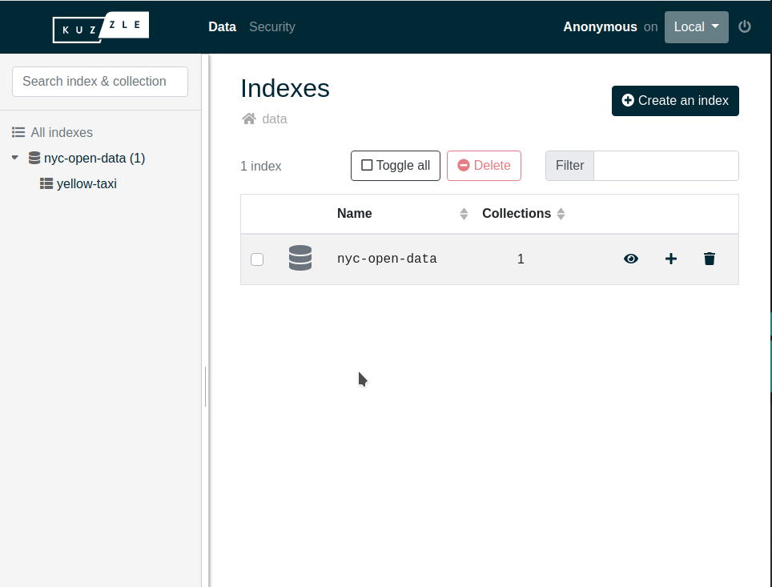

# Store and Access Data

Now that Kuzzle is running, we are going to create some documents.

Kuzzle organizes the data storage in 4 levels:

- Indexes
- Collections
- Documents
- Fields


An index brings together several collections, which in turn contain several documents, each of which is composed of several fields.

The **collections have mappings** that define the way Elasticsearch will index the data for searches.

::: info
By default Elasticsearch will try to infer the type of the fields introduced by documents.  
It is recommended that you define your own mappings in order to specify the desired types for your collections and avoid default types that may be imprecise.
Learn more about [mappings dynamic policy](/core/2/guides/main-concepts/data-storage#mappings-dynamic-policy)
:::

If you're more familiar with the way relational databases store data, here is an analogy. Bear in mind that this is only to give you a rough point of comparison with a relational database, the similarities end here:

| Relational databases storage | Document-oriented storage |
| :--------------------------: | :-----------------------: |
|           database           |           index           |
|            table             |        collection         |
|            schema            |         mappings          |
|             line             |         document          |
|            column            |           field           |

::: info
Kuzzle uses Elasticsearch as a NoSQL document storage.  
Elasticsearch is primarily designed to be a search engine, so there are limitations when using it as a database.  
Learn more about those limitations in our in-depth guides: [Collection Mappings](/core/2/guides/main-concepts/data-storage#mappings-dynamic-policy) and [Querying Elasticsearch](/core/2/guides/main-concepts/querying)
:::

### Prepare the database

First, we are going to create an index with Kourou:

#### Using the http API

```bash
curl -X POST 'http://localhost:7512/nyc-open-data/_create'

## Response
{
  "action": "create",
  "controller": "index",
  "error": null,
  "headers": {},
  "index": "nyc-open-data",
  "node": "knode-debonair-sappho-15470",
  "requestId": "ceb4db93-6b56-4252-9cb3-743880af3b22",
  "status": 200,
  "volatile": null
}
```

#### Using the CLI

```bash
kourou index:create nyc-open-data

## Response

[ℹ] Unknown command "index:create", fallback to API action

 🚀 Kourou - Executes an API query.

 [ℹ] Connecting to ws://localhost:7512 ...
 [✔] Successfully executed "index:create"
```

::: info
When kourou does not recognize a command, it will fallback to the API action.
:::

::: info
This will use the [index:create](/core/2/api/controllers/index/create) API action.
:::

Then, we are going to create a collection inside this index. We will provide the following basic mappings:

```js
{
  properties: {
    name: { type: "keyword" },
    city: { type: "keyword" },
    age: { type: "integer" }
  }
}
```

Run the following command to create our `yellow-taxi` collection:

#### Using the http API

```bash
curl -X PUT 'http://localhost:7512/nyc-open-data/yellow-taxi' \
  -H 'Content-Type: application/json' \
  -d '{
    "mappings": {
      "properties": {
        "name": { "type": "keyword" },
        "city": { "type": "keyword" },
        "age": { "type": "integer" }
      }
    }
  }'

## Response
{
  "action": "create",
  "collection": "yellow-taxi",
  "controller": "collection",
  "error": null,
  "headers": {},
  "index": "nyc-open-data",
  "node": "knode-debonair-sappho-15470",
  "requestId": "d04b0d00-6b5c-4f98-8aa4-4df785d4c447",
  "result": {
    "acknowledged": true
  },
  "status": 200,
  "volatile": null
}
```

#### Using the CLI

```bash
kourou collection:create nyc-open-data yellow-taxi '{
  mappings: {
    properties: {
      name: { type: "keyword" },
      city: { type: "keyword" },
      age: { type: "integer" }
    }
  }
}'


## Response

 🚀 Kourou - Creates a collection

 [ℹ] Connecting to ws://localhost:7512 ...
 [✔] Collection "nyc-open-data":"yellow-taxi" created
```

::: info
This will use the [collection:create](/core/2/api/controllers/collection/create) API action.
:::

### Create some documents

Now we have a collection ready to receive documents, again use Kourou to create one:

#### Using the http API

```bash
curl -X POST 'http://localhost:7512/nyc-open-data/yellow-taxi/_create' \
  -H 'Content-Type: application/json' \
  -d '{
    "name": "Melis",
    "city": "Istanbul",
    "age": 25
  }'

## Response
{
  "action": "create",
  "collection": "yellow-taxi",
  "controller": "document",
  "error": null,
  "headers": {},
  "index": "nyc-open-data",
  "node": "knode-debonair-sappho-15470",
  "requestId": "cc13f52a-3011-4de0-bf2c-00f07c28854b",
  "result": {
    "_id": "jeGgvZIBq6PFWFR7K2xs",
    "_source": {
      "name": "Melis",
      "city": "Istanbul",
      "age": 25,
      "_kuzzle_info": {
        "author": "-1",
        "createdAt": 1729758243688,
        "updatedAt": null,
        "updater": null
      }
    },
    "_version": 1
  },
  "status": 200,
  "volatile": null
}
```

#### Using the CLI

```bash
kourou document:create nyc-open-data yellow-taxi '{
  name: "Melis",
  city: "Istanbul",
  age: 25
}'

## Response
[ℹ] Unknown command "document:create", fallback to API action

 🚀 Kourou - Executes an API query.

 [ℹ] Connecting to ws://localhost:7512 ...
{
  "_id": "juGgvZIBq6PFWFR7eWwW",
  "_source": {
    "name": "Melis",
    "city": "Istanbul",
    "age": 25,
    "_kuzzle_info": {
      "author": "-1",
      "createdAt": 1729758263573,
      "updatedAt": null,
      "updater": null
    }
  },
  "_version": 1
}
 [✔] Successfully executed "document:create"
```

::: info
This will use the [document:create](/core/2/api/controllers/document/create) API action.
:::

Finally, we are going to use the [Admin Console](http://next-console.kuzzle.io) to look at what we have created.

Select the `nyc-open-data` index and then the `yellow-taxi` collection. You should see one document in this collection.



### Search for documents

Kuzzle allows to search for documents through its API, with different query languages depending on your needs.

We'll now use that to search for the documents we're interested in.

First, we need to create more documents:

```bash
kourou sdk:execute '
  for (let i = 1; i <= 10; i++) {
    await sdk.document.create("nyc-open-data", "yellow-taxi", {
      name: `Melis-${i}`,
      city: i % 2 ? "Antalya" : "Istanbul",
      age: 25 + i
    });
  }'

## Response

 🚀 Kourou - Executes arbitrary code.

 [ℹ] Connecting to ws://localhost:7512 ...
 [✔] Successfully executed SDK code
```

::: info
Kourou is able to [execute](https://github.com/kuzzleio/kourou/blob/master/README.md#kourou-sdkexecute-code) Javascript code snippets.  
A `sdk` variable is exposed and refers to an instance of the [Javascript SDK](/sdk/js/7), connected to Kuzzle and authenticated if credentials are provided. Here, we are connected as an anonymous user, so no credentials are required.
:::

Then we are going to use the [document:search](/core/2/api/controllers/document/search) API action to fetch only documents where:

- `age` is greater than `30`
- `city` is equal to `Antalya`

For this, we need to write a [Koncorde Query](/core/2/guides/main-concepts/querying/#koncorde-query):

```js
{
  and: [
    {
      range: {
        age: { gt: 30 },
      },
    },
    {
      equals: { city: "Antalya" },
    },
  ];
}
```

And to execute this query we are going to use Kourou again:

#### Using the http API

```bash
curl -X POST 'http://localhost:7512/nyc-open-data/yellow-taxi/_search' \
  -H 'Content-Type: application/json' \
  -d '{
    "query": {
      "bool": {
        "must": [
          { "range": { "age": { "gt": 30 } } },
          { "term": { "city": "Antalya" } }
        ]
      }
    }
  }'

## Response
{
  "action": "search",
  "collection": "yellow-taxi",
  "controller": "document",
  "error": null,
  "headers": {},
  "index": "nyc-open-data",
  "node": "knode-debonair-sappho-15470",
  "requestId": "838cbc13-a2e8-4a25-bdd2-12102e01b5b1",
  "result": {
    "hits": [
      {
        "_id": "leGnvZIBq6PFWFR7wmw8",
        "_score": 1.8602012,
        "_source": {
          "name": "Melis-7",
          "city": "Antalya",
          "age": 32,
          "_kuzzle_info": {
            "author": "-1",
            "createdAt": 1729758741051,
            "updatedAt": null,
            "updater": null
          }
        },
        "collection": "yellow-taxi",
        "index": "nyc-open-data"
      },
      {
        "_id": "l-GnvZIBq6PFWFR7wmxD",
        "_score": 1.8602012,
        "_source": {
          "name": "Melis-9",
          "city": "Antalya",
          "age": 34,
          "_kuzzle_info": {
            "author": "-1",
            "createdAt": 1729758741059,
            "updatedAt": null,
            "updater": null
          }
        },
        "collection": "yellow-taxi",
        "index": "nyc-open-data"
      }
    ],
    "total": 2
  },
  "status": 200,
  "volatile": null
}
```

#### Using the CLI

```bash
kourou document:search nyc-open-data yellow-taxi '{
  and: [
    {
      range: {
        age: { gt: 30 }
      }
    },
    {
      equals: { city: "Antalya" }
    }
  ]
}'

## Response

 🚀 Kourou - Searches for documents

 [ℹ] Connecting to ws://localhost:7512 ...
 [ℹ] Document ID: leGnvZIBq6PFWFR7wmw8
 Content: {
  "name": "Melis-7",
  "city": "Antalya",
  "age": 32,
  "_kuzzle_info": {
    "author": "-1",
    "createdAt": 1729758741051,
    "updatedAt": null,
    "updater": null
  }
}
 [ℹ] Document ID: l-GnvZIBq6PFWFR7wmxD
 Content: {
  "name": "Melis-9",
  "city": "Antalya",
  "age": 34,
  "_kuzzle_info": {
    "author": "-1",
    "createdAt": 1729758741059,
    "updatedAt": null,
    "updater": null
  }
}
 [✔] 2 documents fetched on a total of 2
```

<details><summary>You should retrieve the following 2 documents:</summary>

```bash
 🚀 Kourou - Searches for documents

 [ℹ] Connecting to http://localhost:7512 ...
 [ℹ] Document ID: OYgZJnUBacNMjDl2504F
 Content: {
  "name": "Melis-7",
  "city": "Antalya",
  "age": 32,
  "_kuzzle_info": {
    "author": "-1",
    "createdAt": 1602662033156,
    "updatedAt": null,
    "updater": null
  }
}
 [ℹ] Document ID: O4gZJnUBacNMjDl2504n
 Content: {
  "name": "Melis-9",
  "city": "Antalya",
  "age": 34,
  "_kuzzle_info": {
    "author": "-1",
    "createdAt": 1602662033189,
    "updatedAt": null,
    "updater": null
  }
}
[✔] 2 documents fetched on a total of 2
```

</details>

<GuidesLinks 
  :prev="{ text: 'Run Kuzzle', url: '/guides/getting-started/run-kuzzle' }" 
  :next="{ text: 'Set up Permissions', url: '/guides/getting-started/set-up-permissions' }" 
/>
