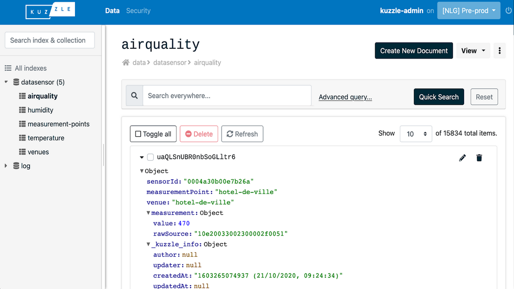
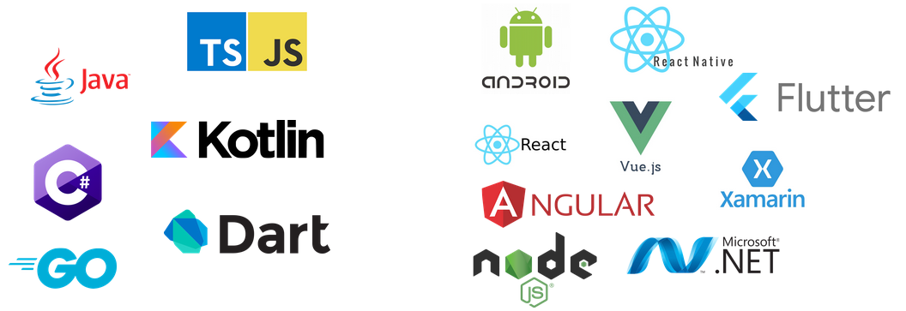
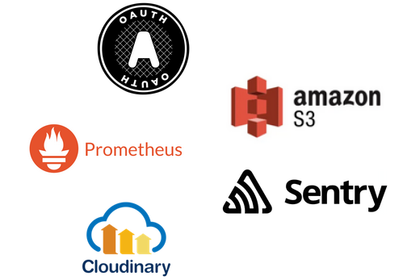

# What is Kuzzle

If you reached this page, it probably is because **you are looking for a backend** for your mobile, web or IoT application.

You were surely thinking about **developing another backend from scratch**, or maybe using some kind of framework to code it faster.

Using a framework is handy because having predefined structures, classes and configurations will indeed make the whole process easier, however you will still have to develop the majority of the basic features you truly need like:
 - Storing and searching data
 - Rights management
 - User authentication
 - Access to data and functionalities via API

Developing **these features can be a huge timesink**, not only to write them but also to debug, test, secure and maintain them as well.

In short, you were going to spend a consequential amount of time on code that **does not bring value to your users**, time that could have been used for many other things like:
 - Development of business functionalities
 - UI / UX of frontend applications
 - 100% coverage by automated tests
 - Implementation of DevOps best practices
 - Product marketing
 - ...

To optimize our own development times and help developers around the world to get their backends running in no time, we started developing Kuzzle, **our ready-to-use backend platform**.

## How it works

Kuzzle is a **backend with ready-to-use features** that can be extended in the same way as any other framework.

When you start Kuzzle, you automatically have access to an API exposing a wide range of features:


<div class="IconTable">
  <div class="IconTable-item">
    <div class="IconTable-item-icon">
      
    </div>
    <div class="IconTable-item-text">
      <a target="_blank" href="/core/2/guides/main-concepts/data-storage">Data storage and access</a>
    </div>
  </div><div class="IconTable-item">
    <div class="IconTable-item-icon">
      
    </div>
    <div class="IconTable-item-text">
      <a target="_blank" href="/core/2/guides/main-concepts/permissions">Advanced permission system</a>
    </div>
  </div><div class="IconTable-item">
    <div class="IconTable-item-icon">
      
    </div>
    <div class="IconTable-item-text">
      <a target="_blank" href="/core/2/guides/main-concepts/authentication">Multi authentication</a>
    </div>
  </div><div class="IconTable-item">
    <div class="IconTable-item-icon">
      
    </div>
    <div class="IconTable-item-text">
      <a target="_blank" href="/core/2/guides/main-concepts/api">Multi protocol API (Http, WebSocket, MQTT)</a>
    </div>
  </div><div class="IconTable-item">
    <div class="IconTable-item-icon">
      
    </div>
    <div class="IconTable-item-text">
      <a target="_blank" href="/core/2/guides/main-concepts/realtime-engine">Realtime engine</a>
    </div>
  </div><div class="IconTable-item">
    <div class="IconTable-item-icon">
      
    </div>
    <div class="IconTable-item-text">
      <a target="_blank" href="/core/2/guides/advanced/cluster-scalability">Integrated cluster mode</a>
    </div>
  </div>
</div>


You can also develop your custom business and high level features by [extending Kuzzle API](/core/2/guides/develop-on-kuzzle/api-controllers) or [modifying API methods behavior](/core/2/guides/develop-on-kuzzle/event-system#pipe).

**Example:** Basic Kuzzle application
```js
import { Backend } from 'kuzzle';

// Instantiate a new application
const app = new Backend('playground');

// Declare a "greeting" controller
app.controller.register('greeting', {
  actions: {
    // Declare a "sayHello" action
    sayHello: {
      handler: request => `Hello, ${request.input.args.name}`
    }
  }
});

// Start the application
app.start()
  .then(() => {
    app.log.info('Application started');
  });
```

## Complete ecosystem

In addition to Kuzzle, we are developing many other projects to facilitate the use of our backend.   

These projects are available under the Apache-2 license on [Github](https://github.com/kuzzleio).

### Admin Console

The [Admin Console](https://next-console.kuzzle.io) is a Single Page Application (SPA) written in Vue.js.  

It is used to manage its data and the user permissions system.

As it is a single-page application (SPA), no data related to your Kuzzle application will pass through our servers, so you can use the online version available at [http://next-console.kuzzle.io](http://next-console.kuzzle.io).



### SDKs

We provide many SDKs to facilitate the use of Kuzzle in applications.  

These SDKs are available for the most common languages and the majority of frontend development platforms:
 - [Javascript / Typescript](/sdk/js/7) : [Node](/sdk/js/7/getting-started/node-js), [React](/sdk/js/7/getting-started/react/standalone), [React Native](/sdk/js/7/getting-started/react-native), [Vue.js](/sdk/js/7/getting-started/vuejs/standalone), Angular, etc
 - [Dart](/sdk/dart/2) : [Flutter](/sdk/dart/2/getting-started/flutter)
 - [Csharp](/sdk/csharp/2) : Xamarin, [.NET](/sdk/csharp/2/getting-started/standalone)
 - [Java / Kotlin](/sdk/jvm/1) : Android, JVM



### Kourou

Kourou is a command line interface that speeds up development with Kuzzle.

It can be used to execute any API action or even code snippets directly.

[See Kourou on Gitub](https://github.com/kuzzleio/kourou)

### Business plugins

We also develop and distribute plugins for Kuzzle.  

These plugins allow you to use the functionalities of other services such as [Amazon S3](https://docs.kuzzle.io/official-plugins/s3/2) or [Prometheus](https://github.com/kuzzleio/kuzzle-plugin-prometheus).

The community is also able and encouraged to develop and distribute its own plugins to enrich the ecosystem.




### Expert Professional Support

The Kuzzle backend and all our projects are developed by a team of engineers based in Montpellier, France.  

Our multidisciplinary team of experts is capable of addressing any type of issue and assisting projects of all sizes.

You can thus pass the development and production phases with a relaxed spirit, knowing that you can rely on quality professional support.

[Get a quote](https://info.kuzzle.io/contact-us)

### Meet the community

We federate a community of developers using Kuzzle around the world.

Whether you want to ask a question on [StackOverflow](https://stackoverflow.com/questions/ask?tags=kuzzle), check out the [Kuzzle awesome list](https://github.com/kuzzleio/awesome-kuzzle), watch our video on [YouTube](https://www.youtube.com/channel/UCHcEzVQoH10YSyxc7jD3SMw/videos), or discuss Kuzzle on [Discord](http://join.discord.kuzzle.io), the community and the core team will be there to help you.
