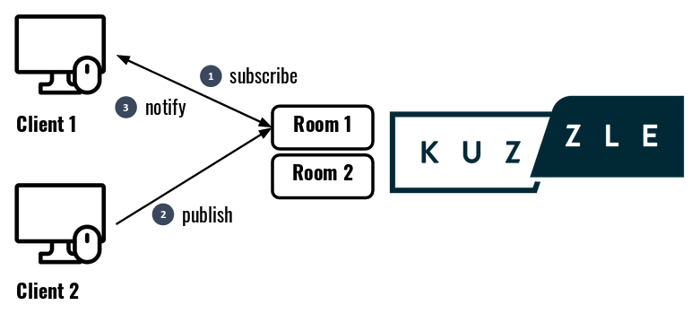
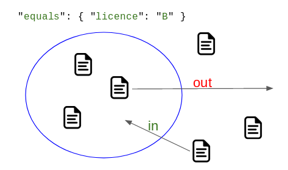

# Realtime Engine

Kuzzle includes his own realtime engine for sending notifications to clients connected through the API.

Realtime capabilities requires the use of a persistent communication protocol such as WebSocket or MQTT.

Kuzzle offers 2 different ways of doing realtime:
 - volatile Pub/Sub system (see example on [Kuzzle tech blog](https://blog.kuzzle.io/pub-sub-for-realtime-applications))
 - realtime database notifications (see example on [Kuzzle tech blog](https://blog.kuzzle.io/develop-a-new-generation-of-apps-with-kuzzle-realtime-engine))

## Pub/Sub

Kuzzle's realtime engine allows you to do Pub/Sub in dedicated communication channels called rooms.

The process is as follows:
 - a customer subscribes to a particular room,
 - a second customer posts a message in this room,
 - the customer subscribing to the room receives a notification.



Subscription to a room is done via the [realtime:subscribe](/core/2/api/controllers/realtime/subscribe) method. It takes 3 parameters, used to describe a specific room:
 - name of an index,
 - name of a collection,
 - subscription filters contained in the `body` of the request.

::: info
In order to use Kuzzle in Pub/Sub mode only, the index and collection do not need to physically exist in the database (e.g. created in Kuzzle via the [index:create](/core/2/api/controllers/index/create) and [collection:create](/core/2/api/controllers/collection/create) methods of the API).
<br/>
These information are only used to define an ephemeral room between several customers.
:::

```json
 {
   "controller": "realtime",
   "action": "subscribe",
   "index": "nyc-open-data",
   "collection": "yellow-taxi",
   "body": {
     // subscription filters
   }
 }
```

Payload to send with wscat:
```json
{"controller":"realtime","action":"subscribe","index":"nyc-open-data","collection":"yellow-taxi","body":{}}
```

Then clients wishing to post messages in this room must use the [realtime:publish](/core/2/api/controllers/realtime/publish) method by specifying the same parameters:

```json
 {
   "controller": "realtime",
   "action": "publish",
   "index": "nyc-open-data",
   "collection": "yellow-taxi",
   "body": {
     "name": "Manwë",
     "licence": "B",
     "car": "berline",
     "position": {
        "lat": 43.6073913,
        "lon": 3.9109057
     }
   }
 }
```

Payload to send with wscat in another terminal:
```json
{"controller":"realtime","action":"publish","index":"nyc-open-data","collection":"yellow-taxi","body":{"name":"Manwë","licence":"B","car":"berline","position":{"lat":43.6073913,"lon":3.9109057}}}
```

Customers subscribing to this channel will receive the following notification:

<details><summary>Click to expand</summary>
<pre>
{
  "status": 200,
  "requestId": "644bc890-9c14-4a8f-afcc-afef444fd6f7",
  "timestamp": 1558690506519,
  "volatile": null,
  "index": "nyc-open-data",
  "collection": "yellow-taxi",
  "controller": "realtime",  // Controller who trigger the notification
  "action": "publish",       // Action who trigger the notification
  "protocol": "websocket",
  "scope": "in",
  "result": {
    "_source": {
      // Content of the published document
      "name": "Manwë",
      "licence": "B",
      "car": "berline",
      "position": {
        "lat": 43.6073913,
        "lon": 3.9109057
      },
      "_kuzzle_info": {
        "author": "-1",
        "createdAt": 1558690506527
      }
    },
    "_id": null
  },
  "type": "document", // Notification is of type document
  "room": "54ffaa49fe470879bed9b0697468bb21-89c22fbf000567a2ed2e7886ed0c51e3"
}
</pre>
</details>

More information about the [Document Notification format](/core/2/api/essentials/notifications#documents-changes-messages)

::: warning
Messages published with the [realtime:publish](/core/2/api/controllers/realtime/publish) method are not persisted in the database.
:::

## Database notifications

Kuzzle's realtime engine allows you to subscribe to notifications corresponding to changes in the database.

::: info
You can bypass notifications from being triggered by using actions from the [bulk controller](/core/2/api/controllers/bulk).
:::

Subscription to a database changes is done via the [realtime:subscribe](/core/2/api/controllers/realtime/subscribe) method, taking 3 parameters:
 - name of the index,
 - name of the collection you want to watch,
 - subscription filters contained in the `body` of the request.

::: info
The specified index and collection must exist in the database to receive database notifications.
:::

When changes occur on this collection (eg: document creation, modification or deletion), Kuzzle will send notifications to the corresponding subscribers.

```json
 {
   "controller": "realtime",
   "action": "subscribe",
   "index": "nyc-open-data",
   "collection": "yellow-taxi",
   "body": {
     // subscription filters
   }
 }
```

Payload to send with wscat:
```json
{"controller":"realtime","action":"subscribe","index":"nyc-open-data","collection":"yellow-taxi","body":{}}
```

For example, creating a document with the [document:create](/core/2/api/controllers/document/create) method corresponds to a change in the database, so customers subscribing to notifications in this collection will be notified.

```json
{
  "controller": "document",
  "action": "create",
  "index": "nyc-open-data",
  "collection": "yellow-taxi",
  "body": {
    "name": "Morgoth",
    "car": "limousine",
    "licence": "B"
  }
}
```

Payload to send with wscat in another terminal:
```json
{"controller":"document","action":"create","index":"nyc-open-data","collection":"yellow-taxi","body":{"name":"Morgoth","licence":"B","car":"limousine"}}
```

Customers subscribing to the changes in this collection will receive the following notification:

<details><summary>Click to expand</summary>
<pre>
{
  "status": 200,
  "requestId": "556e8499-8edc-488c-ab7c-2f6aa9d12acd",
  "timestamp": 1558781280054,
  "volatile": null,
  "index": "nyc-open-data",
  "collection": "yellow-taxi",
  "controller": "document",  // Controller who trigger the notification
  "action": "create",        // Action who trigger the notification
  "protocol": "websocket",
  "scope": "in",
  "result": {
    "_source": {
      // Content of the created document
      "name": "Morgoth",
      "licence": "B",
      "car": "limousine",
      "_kuzzle_info": {
        "author": "-1",
        "createdAt": 1558781280058,
        "updatedAt": null,
        "updater": null
      }
    },
    "_id": "AWrumr8-njeq4FJZaOmC"
  },
  "type": "document",  // Notification is of type document
  "room": "54ffaa49fe470879bed9b0697468bb21-89c22fbf000567a2ed2e7886ed0c51e3"
}
```
</pre>
</details>

More information about the [Document Notification format](/core/2/api/essentials/notifications#documents-changes-messages)

## Subscription filters

When a customer subscribes to realtime notifications, whether in Pub/Sub or Database Notification, he can specify a set of subscription filters.
These filters allow the customer to tell Kuzzle exactly which documents they are interested in and only receive notifications about them.

::: info
These filters are specified only on the client side and do not require server-side implementation.
They are sent in the body of the request [realtime:subscribe](/core/2/api/controllers/realtime/subscribe)
:::

A filter is composed of [term](/core/2/guides/cookbooks/realtime-api/terms) that can be composed with [operands](/core/2/guides/cookbooks/realtime-api/operands).

For example if I want to receive only drivers with the `B` license:
```json
{
  "controller": "realtime",
  "action": "subscribe",
  "index": "nyc-open-data",
  "collection": "yellow-taxi",
  "body": {
    "equals": { "licence": "B" }
  }
}
```

It is also possible to combine [terms](/core/2/guides/cookbooks/realtime-api/terms) between them with [operands](/core/2/guides/cookbooks/realtime-api/operands) to refine my filter:

```json
{
  "controller": "realtime",
  "action": "subscribe",
  "index": "nyc-open-data",
  "collection": "yellow-taxi",
  "body": {
    "and": [
      { "equals": { "licence": "B" } },
      { "equals": { "car": "berline" } }
    ]
  }
}
```

Each subscription filter defines a scope. All documents in the collection can be either inside or outside this scope.

Once a customer has subscribed to notifications with filters, they will receive notifications each time a document enters or exits the scope defined by the filters.



This information is contained in the `scope` field of the notifications:

<details><summary>Click to expand</summary>
<pre>
{
  "status": 200,
  "requestId": "556e8499-8edc-488c-ab7c-2f6aa9d12acd",
  "timestamp": 1558781280054,
  "volatile": null,
  "index": "nyc-open-data",
  "collection": "yellow-taxi",
  "controller": "document",
  "action": "create",
  "protocol": "websocket",
  "scope": "in",           // Notification about a document entering the scope
  "result": {
    "_source": {
      "name": "Manwë",
      "licence": "B",
      "car": "berline",
      "_kuzzle_info": {
        "author": "-1",
        "createdAt": 1558781280058,
        "updatedAt": null,
        "updater": null
      }
    },
    "_id": "AWrumr8-njeq4FJZaOmC"
  },
  "type": "document",
  "room": "54ffaa49fe470879bed9b0697468bb21-89c22fbf000567a2ed2e7886ed0c51e3"
}
</pre>
</details>

## Subscription options

In addition to filters, it is possible to specify options to the [realtime:subscribe](/core/2/api/controllers/realtime/subscribe) method to refine the notifications received or add context information to the notifications that will be sent.

### scope

The [scope](/core/2/api/controllers/realtime/subscribe#arguments) option allows you to specify whether you want to receive notifications regarding documents entering or leaving the scope only.

This parameter can take 3 values:
 - `in`: receive only notifications about documents entering the scope
 - `out`: receive only notifications about documents exiting the scope
 - `all`: (default) receive everything

For example, to be informed of taxis arriving at central park:
```json
{
  "controller": "realtime",
  "action": "subscribe",
  "index": "nyc-open-data",
  "collection": "yellow-taxi",
  "body": {
    "geoBoundingBox": {
      "position": {
        "topLeft": { "lat": 40.759507, "lon": -73.985384 },
        "bottomRight": { "lat": 40.758372, "lon": -73.984591 }
      }
    }
  },
  "scope": "in" // Only documents entering the scope
}
```

### users

The [users](/core/2/api/controllers/realtime/subscribe#arguments) option allows you to receive additional notifications when another client joins or leaves the same room.

This parameter can take 4 values:
 - `in`: only receive notifications when a customer joins the room
 - `out`: only receive notifications when a customer leaves the room
 - `all`: receive everything
 - `none`: (default) receive nothing

```json
 {
   "controller": "realtime",
   "action": "subscribe",
   "index": "nyc-open-data",
   "collection": "yellow-taxi",
   "body": {
   },
   "user": "all" // Receive notification when a user enters or exits the room
 }
```

Payload to send with wscat:
```json
{"controller":"realtime","action":"subscribe","index":"nyc-open-data","collection":"yellow-taxi","body":{},"users":"all"}
```

If a second customer subscribes to the same notifications, then the customer will receive the following notification:

<details><summary>Click to expand</summary>
<pre>
{
  "status": 200,
  "timestamp": 1558792881867,
  "volatile": null,
  "index": "nyc-open-data",
  "collection": "yellow-taxi",
  "controller": "realtime",
  "action": "subscribe",
  "protocol": "websocket",
  "user": "in",   // User entering the room
  "result": {
    "count": 2    // Users subscribed to the room
  },
  "type": "user", // Notification about a user
  "room": "54ffaa49fe470879bed9b0697468bb21-24f5ac19056dbab464867c9515f8dbc5"
}
</pre>
</details>

More information about the [User Notification format](/core/2/api/essentials/notifications#user-notification)

### volatile data

[Volatile data](/core/2/api/essentials/volatile-data) are metadata that can be added to each request made to the Kuzzle API.

When a request containing volatile data triggers a realtime notification, these volatile data are included in the notification that will be sent to the subscribing customers.

For example, if a customer subscribes to the following notifications:

```json
 {
   "controller": "realtime",
   "action": "subscribe",
   "index": "nyc-open-data",
   "collection": "yellow-taxi",
   "body": {
     // subscription filters
   }
 }
```

Payload to send with wscat:
```json
{"controller":"realtime","action":"subscribe","index":"nyc-open-data","collection":"yellow-taxi","body":{}}
```

If another client publishes a message in the room specifying volatile data:

```json
 {
   "controller": "realtime",
   "action": "publish",
   "index": "nyc-open-data",
   "collection": "yellow-taxi",
   "body": {
     "name": "Ulmo",
     "licence": "B"
   },
   "volatile": {
     "senderName": "Eru Ilúvatar"
   }
 }
```

Payload to send with wscat in another terminal:
```json
{"controller":"realtime","action":"publish","index":"nyc-open-data","collection":"yellow-taxi","body":{"name":"Manwë","licence":"B","car":"berline","position":{"lat":43.6073913,"lon":3.9109057}},"volatile":{"senderName":"Eru Ilúvatar"}}
```

Each customer who subscribes to the room will receive the following notification:

<details><summary>Click to expand</summary>
<pre>
{
  "status": 200,
  "requestId": "644bc890-9c14-4a8f-afcc-afef444fd6f7",
  "timestamp": 1558690506519,
  "volatile": {
     "senderName": "Eru Ilúvatar" // Volatile data included in the notification
   },
  "index": "nyc-open-data",
  "collection": "yellow-taxi",
  "controller": "realtime",
  "action": "publish",
  "protocol": "websocket",
  "scope": "in",
  "result": {
    "_source": {
      "name": "Ulmo",
      "licence": "B",
      "_kuzzle_info": {
        "author": "-1",
        "createdAt": 1558690506527
      }
    },
    "_id": null
  },
  "type": "document",
  "room": "54ffaa49fe470879bed9b0697468bb21-89c22fbf000567a2ed2e7886ed0c51e3"
}
</pre>
</details>
