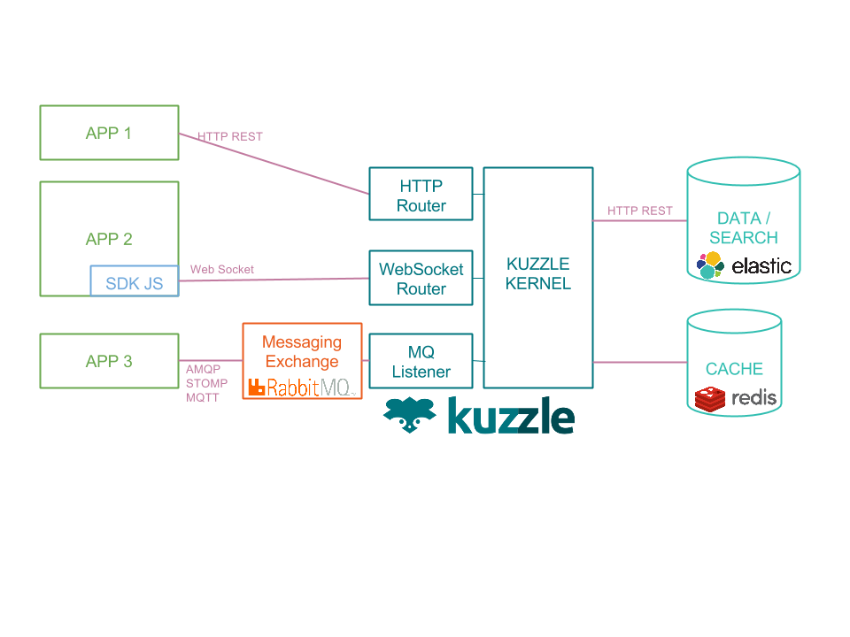
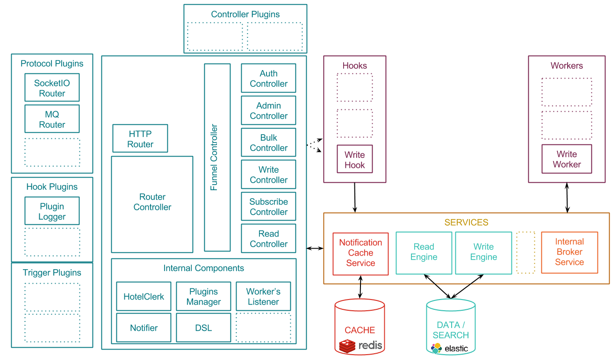

# Kuzzle Architecture

## Global overview

<!--Est-ce que "ways" est un terme consacré ?-->
Kuzzle Kernel API can be accessed from 3 different ways:
1. a [RESTFul API](api-specifications.md#REST)
2. a [Websocket connexion](api-specifications.md#Websocket), using Kuzzle [Javascript SDK](https://stash.kaliop.net/projects/LABS/repos/kuzzle-sdk-js)
3. or a [messaging broker](api-specifications.md#AMQP-STOMP-MQTT) such as RabbitMQ (using any protocol supported by your broker, such as AMQP, MQTT, STOMP)

In the background, Kuzzle uses:
* a noSQL engine to store, index and search contents (we use Elasticsearch by default).
* a cache engine to store subscription lists (we use redis by default).

## Core architecture

Focus on the above "Kuzzle kernel":

### Main core components

* **Router Controller**: implements the 3 API routers, normalizes the input message and sends them to the Funnel Controller
* **Funnel Controller**: analyses the input message and calls the appropriate controller (see [API specification](api-specifications.md))
* **Admin Controller**, **Bulk Controller**, **Write Controller**, **Subscribe Controller**, **Read Controller**: handles the input message (see [API specification](api-specifications.md))
* **Internal Components**: Any components used internally by controllers and any other internal components to interact with services
<!--Que voulez-vous dire dans la phrase précédente "Aucun composant" ou "N'importe quel composant" ?-->

### Hooks

Hooks allow to attach actions to Kuzzle events.

For example, Admin, Bulk and Writer controllers emit a "data:create" event to handle some writing actions through the storage engine.
This event will trigger the execution of the *add* method and of the *write* hook, which will send the received message to the broker service.

Then it is possible to implement custom hooks to trigger any event emitted by Kuzzle.

_For more details, see [hooks description](../lib/hooks/README.md)_

### Services

In Kuzzle, a Service module is the implementation of the interface to external services used by the application (AMQP broker, storage engine, cache engine, etc.)

_For more details, see [services description](../lib/services/README.md)_

### Workers

A Worker is a component that is designed to possibly run outside of the main Kuzzle instance. <!--"Instance" est un terme consacré ?-->

Workers attach themselves to the broker service that is fed by Kuzzle to perform any kind of tasks.

For instance, writing persistent data on Kuzzle is implemented as a write worker.

Additionally, serveral Workers of the same type can be launched in parallel, on the same or on a different host.

This flexibility allows administrators of Kuzzle system to leverage their resource consumption and distribute and/or scale their services to better fit their needs.

_For more details, see [workers description](../lib/workers/README.md)_

## Next steps

See [Request Scenarios documentation](request_scenarios/README.md) to see how these components are used together to handle a client's action.

