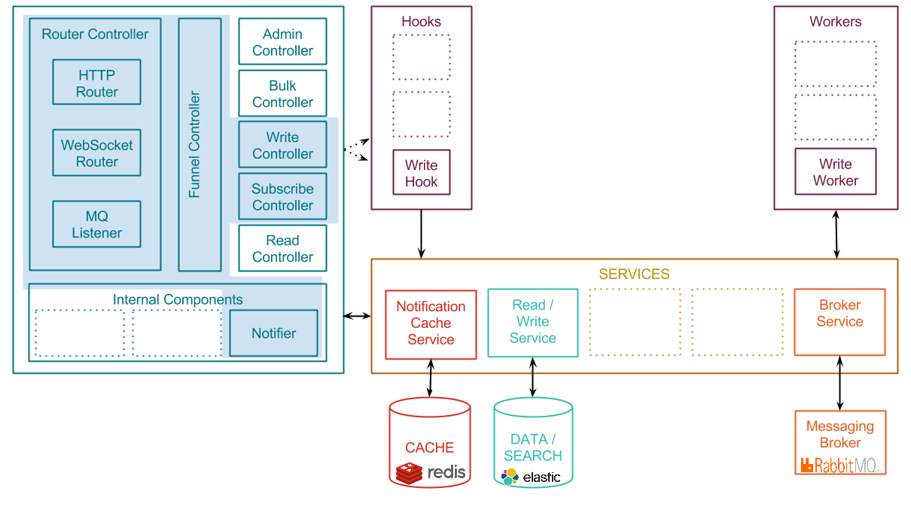
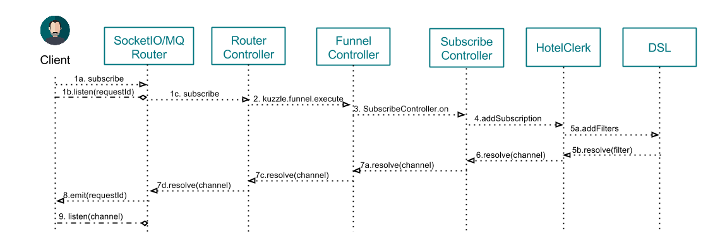
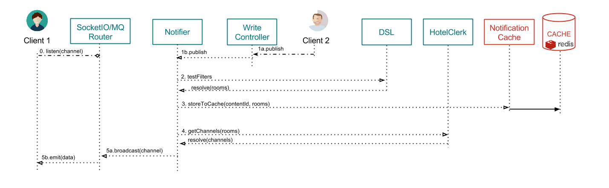

# Realtime Pub/Sub scenario

This page explains what happens when clients exchange data with Kuzzle, using the [Publish/Subscribe pattern](https://en.wikipedia.org/wiki/Publish%E2%80%93subscribe_pattern).

Kuzzle is able to manage two different types of data:
* persistent data
* volatile/realtime data

The client decide if a data is persistent or volatile using the "_persist_" metadata (true/false).

Kuzzle handles data differently, depending if its persistent or not.

This page describes the process for **non persistent** data. If you wish to learn about how Kuzzle handles persistent data, please read [Writing persistent data to Kuzzle](write.md)

Remember the [Architecture overview](../architecture.md) and focus on the components involved by reading actions:


## 1st step : subscription

The following diagram shows how two different clients, a Websocket and a MQ one, subscribe to data.



\#1a. The client application opens a Websocket connection and emit a "subscribe" event with some filters.
For instance, to be notified about new messages posted to the collection "users", containing a field "hobby" equals to "computer":
```json
{
  "requestId": "ed4faaff-253a-464f-a6b3-387af9d8483d",
  "action": "on",
  "collection": "users",
  "filter": {
    "term": {"hobby": "computer" }
  }
}
```

(see [Filters](../filters.md) for more details about filters)


\#1b. The client then listens to the ```<requestId>``` event on the socket.
Kuzzle will get back to him with a corresponding Room ID using this event.

Sample Javascript code :

```javascript
  this.socket.once("ed4faaff-253a-464f-a6b3-387af9d8483d", function(response) {
    callback(response);
  });
```


\#2. The ```Websocket router``` interprets the input request and tranfer the subscription message to the ```Funnel Controller```.

Sample message:
```json
{
  "controller": "subscribe",
  "collection": "users",
  "action": "on",
  "filter": {
    "term": {"hobby": "computer" }
  }
}
```

\#3. The ```Funnel Controller``` validates the message and transfer it to the ```Subscribe Controller```

\#4. The ```Subscribe Controller``` calculates the pub/sub room related to this filter, adds an internal reference to the client, and returns the Room ID.

\#5. Callback functions are triggered to transmit the response message back to the ```Websocket Router```

\#6. The Websocket Router emits a ```<requestId>``` event to the client, containing the subscribed room Id.

Sample response content:

```json
{
  "error": null,
  "result": "891b0d98-7a2c-4c60-9edd-d3444ffe4a8e"
}
```

\#7. The client now listens to this ```roomId``` events to be notified about new messages corresponding to his subscription filters.

\#8. => \#15. The process follows roughly the same pattern for a MQ client, with small tweaks depending of the MQ protocol used (AMQP, MQTT or STOMP).

## 2nd step : notify about content changes to subscribing clients
The following diagram shows how Kuzzle handles a new message and how subscribed clients are notified:




\#1. A client sends a new content to Kuzzle, either through a HTTP request, a Websocket connection or a MQ client (see [Reading scenarios](README.md#Reading-content-from-Kuzzle))

\#2. The router handles the input request and transmit the message to the ```Funnel Controller```.

Sample message: (**note that _persist = false_**)

```json
{
  "controller": "write",
  "collection": "users",
  "action": "create",
  "persist": false,
  "body": {
      "firstName": "Grace",
      "lastName": "Hopper",
      "age": 85,
      "location": {
        "lat": 32.692742,
        "lon": -97.114127
      },
      "city": "NYC",
      "hobby": "computer"
  }
}
```

\#3. The ```Funnel Controller``` validates the message and forward it to the ```Write Controller```

\#4. The ```Write Controller``` sends a feedback to the client who emitted the message.

\#5. The ```Write Controller``` calculates the rooms whose filters match this new message, and calls the ```Notifier``` core component.


\#6. The ```Notifier``` component notifies the subscribing clients, either directly through Websocket, and/or via the MQ Broker.


## Related pages

* [Architecture overview](../architecture.md)
* [API Specifications](../api-specifications.md)
