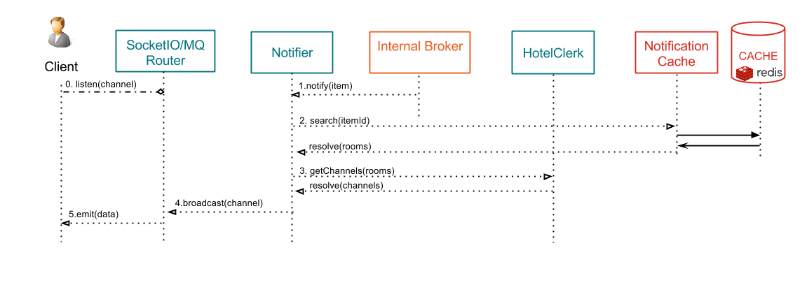

# Realtime Pub/Sub scenario

This page explains what happens when clients exchange data with Kuzzle, using the [Publish/Subscribe pattern](https://en.wikipedia.org/wiki/Publish%E2%80%93subscribe_pattern).

Kuzzle is able to manage two different types of data:
* persistent data => using the "_create_", "_createOrUpdate_", or "_delete_" actions.
* volatile/realtime data => using the "_publish_" action.

Kuzzle handles data differently, depending if it's persistent or not.

This page describes the process for **non persistent** data, as well as real-time notification about persisted data.

If you wish to learn about how Kuzzle stores persistent data, please read [Writing persistent data to Kuzzle](write.md)

Remember the [Architecture overview](../architecture.md) and focus on the components involved by reading actions:


## 1st step : subscription

The following diagram shows how two different clients, a Websocket and a MQ one, subscribe to data.


\#1. The client application opens a Websocket or a MQ connection and emits a "subscribe" event with some filters.
(see [API Documentation](http://kuzzleio.github.io/kuzzle-api-documentation/#on))

For instance, to be notified about all contents posted to the collection "users", containing a field "hobby" equals to "computer":
```json
{
  "requestId": "ed4faaff-253a-464f-a6b3-387af9d8483d",
  "index": "mainindex",
  "collection": "users",
  "action": "on",
  "body": {
    "term": {"hobby": "computer" }
  },
  "state": "all"
}
```

(see [Filters](../filters.md) for more details about filters)


\#1b. The client then listens to the ```<requestId>``` event on the socket.
Kuzzle will get back to him with a corresponding Room ID using this event.

Sample Javascript code, using Websocket:

```javascript
  this.socket.once("ed4faaff-253a-464f-a6b3-387af9d8483d", function(response) {
    callback(response);
  });
```


\#2. The ```Router Controller``` interprets the input request and transfer the subscription message to the ```Funnel Controller```.

Sample message:
```json
{
  "index": "mainindex",
  "collection": "users",
  "controller": "subscribe",
  "action": "on",
  "filter": {
    "term": {"hobby": "computer" }
  }
}
```

\#3. The ```Funnel Controller``` validates the message and transfer it to the ```Subscribe Controller```.

\#4. The ```Subscribe Controller``` calls the ```HotelClerk``` internal component to create the subscription.

\#5. The ```HotelClerk``` calls the ```DSL``` component to get a formated filter related to the subscription (see [DSL Readme for more details](../../lib/api/dsl/README.md)).

\#6. The ```HotelClerk``` create a channel related to the filters and give it back to the ```Subscribe Controller```.

\#7. The channel is send back to the Websocket (or MQ) Router through the internal components.

\#8. The Websocket (or MQ) Router emits a ```<requestId>``` event to the client, containing the subscribed channel ID.

Sample response content:

```json
{
  "status": 200,
  "error": null,
  "index": "mainindex",
  "collection": "users",
  "controller": "subscribe",
  "action": "on",
  "state": "all",
  "requestId": "ed4faaff-253a-464f-a6b3-387af9d8483d",
  "result": {
    "roomId": "78c5b0ba-fead-4535-945c-8d64a7927459",
    "channel": "c5cd8bdc-06a4-4d6e-bae3-61f1a8ac2982"
  }
}
```

\#8. The client now listens to this ```channel``` events to be notified about new messages corresponding to his subscription filters.


## 2nd step : notify about real-time actions
The following diagram shows how Kuzzle handles a new message and how subscribed clients are notified:


\#1. A new content is published to the ```Notifier``` component.

The "_publish_" method can be triggered:
* either direclty by the ```Write Controller``` for non persistent data (using the [publish](http://kuzzleio.github.io/kuzzle-api-documentation/#publish) action).
* or by by the ```Plugins Manager``` when a 'data:create' event is triggered, to notify users in real-time before the data are sent to the storage Engine.

\#2. The ```Notifier``` calls the ```DSL``` component to test registered filters that match the content, and get related rooms.

\#3. The ```Notifier``` uses the ```Notification Cache``` engine to store the mapping content/rooms into cache.

\#4. The ```Notifier``` calls the ```HotelClerk``` to get the channels related to the rooms.

\#5. The ```Notifier``` broadcasts the message to each related channel to the Websocket (or MQ) router.

\#6. Finally, the router send the message to the clients who subscribed to it.

## 3rd step : notify about persisted data



\#1. The ```Notifier``` component is notified about a new action by the ```Internal Broker``` (see [step \#11. in write scenario](write.md)).

\#2. The ```Notifier``` calls the ```Notification Cache``` to get the rooms related to the content.

\#3. The ```Notifier``` calls the ```HotelClerk``` to get the channels related to the rooms.

\#4. The ```Notifier``` broadcasts the message to each related channel to the Websocket (or MQ) router.

\#5. Finally, the router send the message to the clients who subscribed to it.

## Related pages

* [Architecture overview](../architecture.md)
* [API Documentation](http://kuzzleio.github.io/kuzzle-api-documentation)
