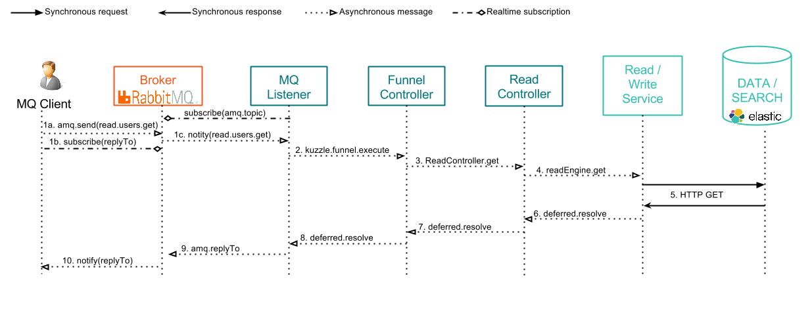

# Reading content from Kuzzle - The Broker way

This page explain the scenario that is run while a client is reading contents from Kuzzle through a message broker such as RabbitMQ.

By "reading", we mean any action that gets contents from persistent layer to give them to the client:
get a single content, count a collection, or search contents with advanced filters.

Remember the [Architecture overview](../architecture.md) and focus on the components involved by reading actions:


The following diagram shows how request's data are exchanged between the client application, the different Kuzzle components, and the external services:



\#0. Kuzzle's MQ Listener has subscribed to the default broker's topics for each controller (sample : "_read.\*.\*_") (see details in [API Specifications](../api-specifications.md)).

\#1a. \#1b. The client application send a message to RabbitMQ's topic "_read.<collection>.get_". The message contains also a "replyTo" header with a temporary queue Id.

Sample STOM request:

```
SEND
destination:/exchange/amq.topic/read.users.get
reply-to:/temp-queue/739c26bc-7a09-469a-803d-623c4045b0cb
content-type:application/json

{_id: "739c26bc-7a09-469a-803d-623c4045b0cb"}

^@
```

\#1c. The broker notifies the MQ Listener with the incoming message


\#2. The MQListener handles the input message and transmit it to the Funnel Controller.

Sample message:

```json
{
  "controller": "read",
  "collection": "users",
  "action": "get",
  "_id": "739c26bc-7a09-469a-803d-623c4045b0cb"
}
```

\#3. The Funnel Controller handles the message and route it to the good controller, ie Read Controller

\#4. The Read Controller calls the readEngine service

\#5. The readEngine service makes a synchronous HTTP Rest request to get the data from the data storage

Sample content retrieve from Elasticsearch:

```json
{
  "_id": "739c26bc-7a09-469a-803d-623c4045b0cb",
  "firstName": "Grace",
  "lastName": "Hopper",
  "age": 85,
  "location": {
    "lat": 32.692742,
    "lon": -97.114127
  },
  "city": "NYC",
  "hobby": "computer"
}
```

\#6. \#7. \#8. Callback functions are triggered to transmit the response message back to the MQ Listener

Sample content exchanged during callback excecution:

```json
{
  "data": {
    "_id": "739c26bc-7a09-469a-803d-623c4045b0cb",
    "firstName": "Grace",
    "lastName": "Hopper",
    "age": 85,
    "location": {
      "lat": 32.692742,
      "lon": -97.114127
    },
    "city": "NYC",
    "hobby": "computer"
  }
}
```
\#9. The MQ Listener sends message to the "replyTo" temporary queue to to the broker.

\#10. The broker notifies the client with the reponse content.

Sample response content:

```json
{
  "error": null,
  "result": {
    "_id": "739c26bc-7a09-469a-803d-623c4045b0cb",
    "firstName": "Grace",
    "lastName": "Hopper",
    "age": 85,
    "location": {
      "lat": 32.692742,
      "lon": -97.114127
    },
    "city": "NYC",
    "hobby": "computer"
  }
}
```

## Related pages

* [Architecture overview](../architecture.md)
* [API Specifications](../api-specifications.md)
