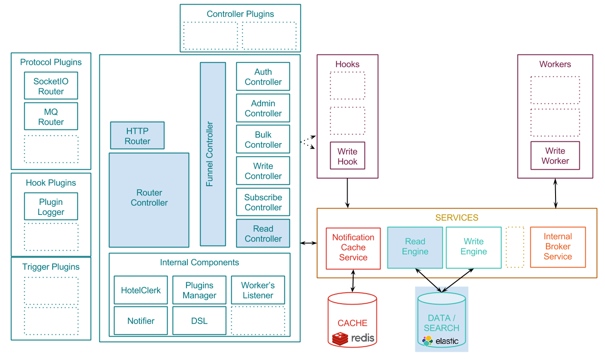
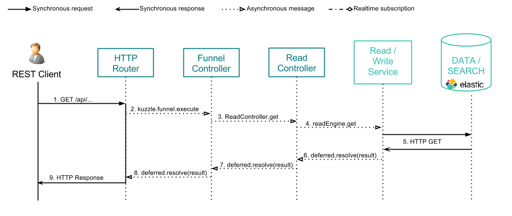

# Reading content from Kuzzle - The HTTP Rest way

This page explain the scenario that is run while a client is reading contents from Kuzzle with the REST API.

By "reading", we mean any action that gets contents from persistent layer to give them to the client:
get a single content, count a collection, or search contents with advanced filters.

Remember the [Architecture overview](../architecture.md) and focus on the components involved by reading actions:


The following diagram shows how request's data are exchanged between the client application, the different Kuzzle components, and the external services:



\#1. Rest client makes a HTTP GET Request to ask for a content.

Sample request: retrieve the document '739c26bc-7a09-469a-803d-623c4045b0cb' in the collection 'users':
GET http://kuzzle:8081/api/users/739c26bc-7a09-469a-803d-623c4045b0cb

\#2. The HTTP router handles the input request and transmit message to the Funnel Controller.

Sample message:

```json
{
  "controller": "read",
  "collection": "users",
  "action": "get",
  "_id": "739c26bc-7a09-469a-803d-623c4045b0cb"
}
```

\#3. The Funnel Controller process validation before sending the request to the Read Controller

\#4. The Read Controller calls the readEngine service

\#5. The readEngine service makes a HTTP Rest request to get the data from the data storage

Sample content retrieve from Elasticsearch:

```json
{
  "_index": "mainindex",
  "_type": "users",
  "_id": "739c26bc-7a09-469a-803d-623c4045b0cb",
  "_version": 1,
  "found": true,
  "_source": {
      "firstName": "Grace",
      "lastName": "Hopper",
      "age": 85,
      "location": {
          "lat": 32.692742,
          "lon": -97.114127
      },
      "city": "NYC",
      "hobby": "computer"
  }
}
```

\#6. \#7. \#8. Callback functions are triggered to transmit the response message back to the HTTP Router

Sample content exchanged during callback excecution:

```json
{
  "data": {
    "_index": "mainindex",
    "_type": "users",
    "_id": "739c26bc-7a09-469a-803d-623c4045b0cb",
    "_version": 1,
    "found": true,
    "_source": {
        "firstName": "Grace",
        "lastName": "Hopper",
        "age": 85,
        "location": {
            "lat": 32.692742,
            "lon": -97.114127
        },
        "city": "NYC",
        "hobby": "computer"
    }
  }
}
```
\#9. The HTTP Router send the response to the Rest client.

Sample content:

```json
{
  "_index": "mainindex",
  "_type": "users",
  "_id": "739c26bc-7a09-469a-803d-623c4045b0cb",
  "_version": 1,
  "found": true,
  "_source": {
      "firstName": "Grace",
      "lastName": "Hopper",
      "age": 85,
      "location": {
          "lat": 32.692742,
          "lon": -97.114127
      },
      "city": "NYC",
      "hobby": "computer"
  }
}
```

## Related pages

* [Architecture overview](../architecture.md)
* [API Specifications](../api-specifications.md)
