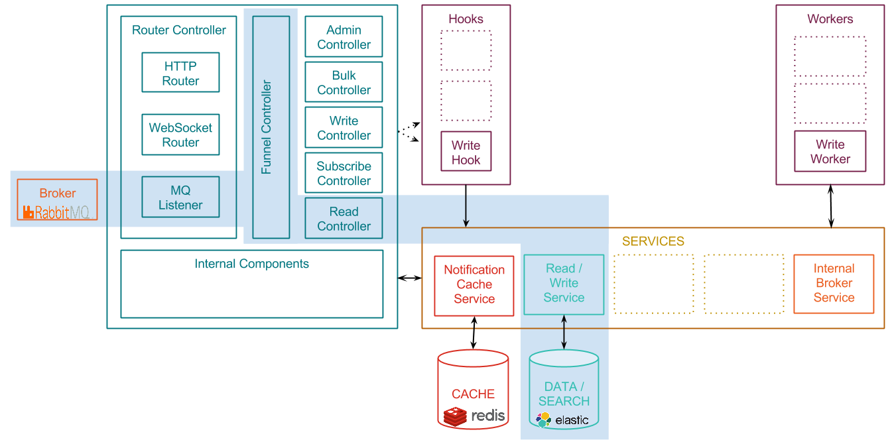
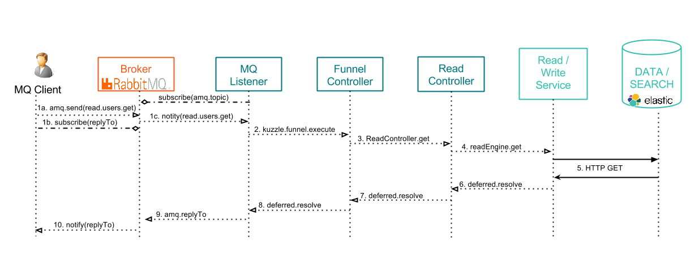

# Reading content from Kuzzle using MQ

This page explains what happens when clients exchange data with Kuzzle, using a messaging protocol (currently supported: AMQP, MQTT, STOMP).

By "reading", we mean any action involving getting content from the persistent layer: getting a single document, count documents, or search contents with advanced filters.

Remember the [Architecture overview](../architecture.md) and focus on the components involved by reading actions:


The following diagram shows how request data is exchanged between the client application, the different Kuzzle components, and the external services:



\#1a. \#1b. The client application sends a message to a topic (MQTT), an ```amq.topic/kuzzle``` routing key (AMQP) or an ```amq.topic/kuzzle``` destination (STOMP).

(see details in [API Documentation](http://kuzzleio.github.io/kuzzle-api-documentation/#message-queuing-protocols)).

A MQTT client wishing to get responses back from Kuzzle must add a ```mqttClientId``` field to his message, and to subscribe to the ```mqtt.<mqttClientId>``` topic.

AMQP and STOMP clients simply have to fill the ```replyTo``` metadata and to listen to the corresponding queue/destination.

Sample STOMP request: retrieve the document ```739c26bc-7a09-469a-803d-623c4045b0cb``` in the collection ```users```:

```
SEND
destination:/exchange/amq.topic/kuzzle
reply-to:/temp-queue/739c26bc-7a09-469a-803d-623c4045b0cb
content-type:application/json

{
  "index": "mainindex",
  "collection": "users",
  "controller": "read",
  "action": "get",
  "_id": "739c26bc-7a09-469a-803d-623c4045b0cb"
}

^@
```

\#2. The MQ plugin handles the input message and forward it to the ```Funnel Controller```.

Sample message:

```json
{
  "index": "mainindex",
  "collection": "users",
  "controller": "read",
  "action": "get",
  "_id": "739c26bc-7a09-469a-803d-623c4045b0cb"
}
```

\#3. The ```Funnel Controller``` validates the message and forward the request to the ```Read Controller```

\#4. The ```Read Controller``` calls the ```readEngine service```

\#5. The ```readEngine service``` performs an HTTP Rest request to get the data from the data storage

Sample content retrieval from Elasticsearch:

```json
{
  "_index": "mainindex",
  "_type": "users",
  "_id": "739c26bc-7a09-469a-803d-623c4045b0cb",
  "_version": 1,
  "found": true,
  "_source": {
      "firstName": "Grace",
      "lastName": "Hopper",
      "age": 85,
      "location": {
          "lat": 32.692742,
          "lon": -97.114127
      },
      "city": "NYC",
      "hobby": "computer"
  }
}
```

\#6. \#7. \#8. Callback functions are triggered to transmit the response message back to the MQ plugin

Sample content exchanged during callback excecution:
```json
{
  "data": {
    "_index": "mainindex",
    "_type": "users",
    "_id": "739c26bc-7a09-469a-803d-623c4045b0cb",
    "_version": 1,
    "found": true,
    "_source": {
        "firstName": "Grace",
        "lastName": "Hopper",
        "age": 85,
        "location": {
            "lat": 32.692742,
            "lon": -97.114127
        },
        "city": "NYC",
        "hobby": "computer"
    }
  }
}
```

\#9. The MQ plugin notifies the client with the response content.

Sample response content:

```json
{
  "status": 200,
  "error": null,
  "result": {
    "_index": "mainindex",
    "_type": "users",
    "_id": "739c26bc-7a09-469a-803d-623c4045b0cb",
    "_version": 1,
    "found": true,
    "_source": {
        "firstName": "Grace",
        "lastName": "Hopper",
        "age": 85,
        "location": {
            "lat": 32.692742,
            "lon": -97.114127
        },
        "city": "NYC",
        "hobby": "computer"
    }
  }
}
```

## Related pages

* [Architecture overview](../architecture.md)
* [API Documentation](http://kuzzleio.github.io/kuzzle-api-documentation)
