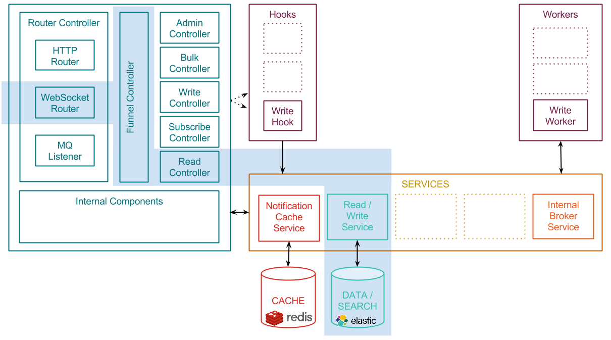
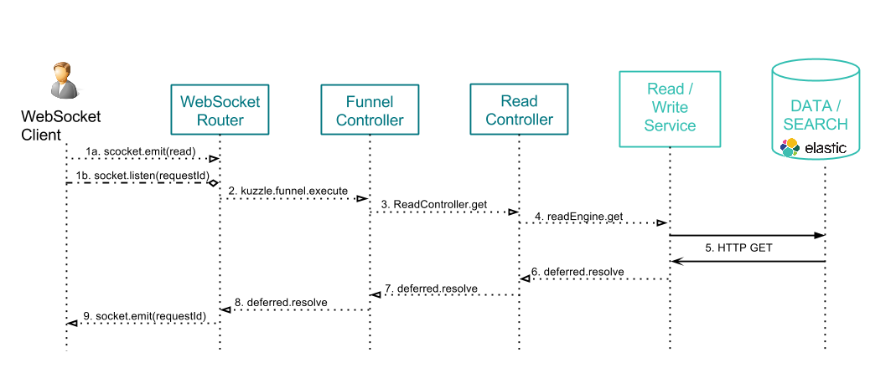

# Reading content from Kuzzle using Websockets

This page explains what happens when clients exchange data with Kuzzle, using Websockets.

By "reading", we mean any action involving getting content from the persistent layer: getting a single document, count documents, or search contents with advanced filters.

Remember the [Architecture overview](../architecture.md) and focus on the components involved by reading actions:


The following diagram shows how request data is exchanged between the client application, the different Kuzzle components, and the external services:



\#1a. The client application opens a Websocket connection and emit a "read" event containing the request

For instance, to retrieve the document ```739c26bc-7a09-469a-803d-623c4045b0cb``` in the collection ```users```:

```json
{
  "requestId": "ed4faaff-253a-464f-a6b3-387af9d8483d",
  "action": "get",
  "collection": "users",
  "_id": "739c26bc-7a09-469a-803d-623c4045b0cb"
}
```

\#1b. The client then listens to the ```<requestId>``` event on the socket. The result of his request will be sent using this event.

Sample JS code :
```javascript
  this.socket.once("ed4faaff-253a-464f-a6b3-387af9d8483d", function(response) {
    callback(response);
  });
```


\#2. The Websocket router handles the input request and forward the message to the ```Funnel Controller```

Sample message:

```json
{
  "controller": "read",
  "collection": "users",
  "action": "get",
  "_id": "739c26bc-7a09-469a-803d-623c4045b0cb"
}
```

\#3. The ```Funnel Controller``` validates the message and forward the request to the ```Read Controller```

\#4. The ```Read Controller``` calls the ```readEngine service```

\#5. The ```readEngine service``` performs an HTTP REST request to get the data from the data storage

Sample content retrieval from Elasticsearch:

```json
{
  "_index": "mainindex",
  "_type": "users",
  "_id": "739c26bc-7a09-469a-803d-623c4045b0cb",
  "_version": 1,
  "found": true,
  "_source": {
      "firstName": "Grace",
      "lastName": "Hopper",
      "age": 85,
      "location": {
          "lat": 32.692742,
          "lon": -97.114127
      },
      "city": "NYC",
      "hobby": "computer"
  }
}
```

\#6. \#7. \#8. Callback functions are triggered to transmit the response message back to the Websocket Router

Sample content exchanged during callback excecution:

```json
{
  "data": {
    "_index": "mainindex",
    "_type": "users",
    "_id": "739c26bc-7a09-469a-803d-623c4045b0cb",
    "_version": 1,
    "found": true,
    "_source": {
        "firstName": "Grace",
        "lastName": "Hopper",
        "age": 85,
        "location": {
            "lat": 32.692742,
            "lon": -97.114127
        },
        "city": "NYC",
        "hobby": "computer"
    }
  }
}
```
\#9. The Websocket Router emits a ```<requestId>``` event to the client websocket

Sample response content:

```json
{
  "error": null,
  "result": {
    "_index": "mainindex",
    "_type": "users",
    "_id": "739c26bc-7a09-469a-803d-623c4045b0cb",
    "_version": 1,
    "found": true,
    "_source": {
        "firstName": "Grace",
        "lastName": "Hopper",
        "age": 85,
        "location": {
            "lat": 32.692742,
            "lon": -97.114127
        },
        "city": "NYC",
        "hobby": "computer"
    }
  }
}
```

## Related pages

* [Architecture overview](../architecture.md)
* [API Specifications](../api-specifications.md)
