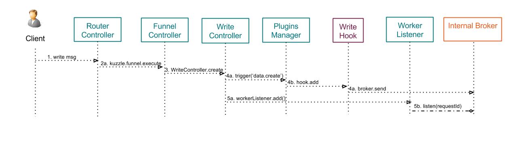
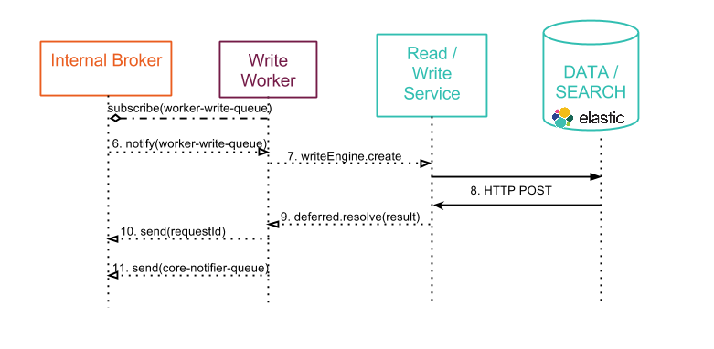
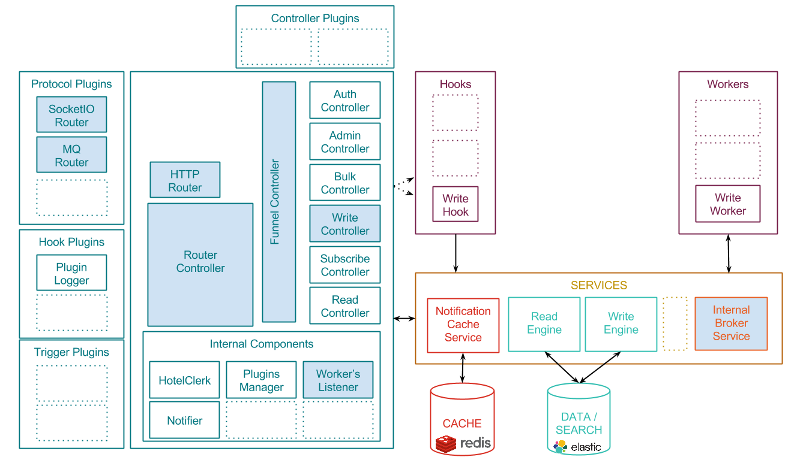
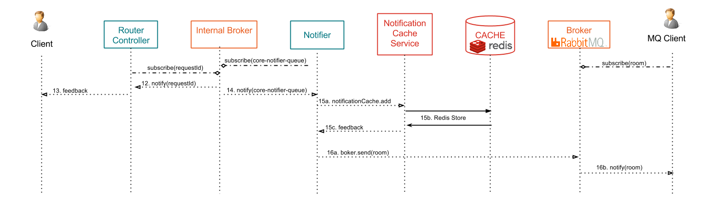

# Writing persistent data into Kuzzle

This page explains what happens when clients send new content to Kuzzle

Kuzzle is able to manage two different types of data:
* persistent data
* volatile/realtime data

The client decide if a data is persistent or volatile using the "_persist_" metadata (true/false).

Kuzzle handles data differently, depending if it's persistent or not.


This page describes the process for **persistent** data. If you wish to learn about how Kuzzle handles volatile data, please read [Pub/Sub scenario for realtime data](pubsub.md)

Remember the [Architecture overview](../architecture.md).

Kuzzle persistent data writing is a 3-steps process:

## 1st step: Send a Write request to a task queue

Involved components overview:


Detailed workflow:



\#1. A client sends new content to Kuzzle, either with an HTTP request, through a websocket connection or using a MQ client (see [Reading scenarios](README.md#Reading-content-from-Kuzzle))

\#2a. The router handles the input request and forward the message to the ```Funnel Controller```

Sample message: (**note that _persist = true_**)

```json
{
  "controller": "write",
  "collection": "users",
  "action": "create",
  "persist": true,
  "body": {
      "firstName": "Grace",
      "lastName": "Hopper",
      "age": 85,
      "location": {
        "lat": 32.692742,
        "lon": -97.114127
      },
      "city": "NYC",
      "hobby": "computer"
  }
}
```

\#2b. The router then subscribes a listener to the task queue to notify the client about his request status

\#3. The ```Funnel Controller``` validates the message and forward the request to the ```Write Controller```

\#4. \#5. The Write Hook intercepts the request and sends it to the internal broker. (see [Hooks Readme](../../lib/hooks/README.md) for more details about hooks)

That way Kuzzle parallelizes the processing of writing contents.

## 2nd step: Save content into the storage engine

Involved components overview:


Detailed workflow:



\#6. A ```Write Worker``` is notified by the internal broker about a new write request.

\#7. The worker calls the ```writeEngine service```

\#8. The ```writeEngine service``` performs an HTTP Rest request to send the data to the data storage

\#9. Callback functions are triggered to transmit the response message back to the ```Write Worker```

\#10. The worker sends the feedback message from ElasticSearch to the input task queue (see \#2b).

\#11. The worker also sends a notification message to the internal broker, to notify subscribing clients, if any (see step 3 below).

## 3rd step: Send feedback and notify pub/sub clients

Involved components overview:



Detailed workflow, with another client who has subscribed to a room and who will be notified about this new document (see [Pub/Sub scenario for realtime data](pubsub.md) for more details about subscribtions):



\#12. The listener that the ```Router Controller``` registered in step 2b receive a notification from the write worker...

\#13. ... and forward it back to the client.

\#14. The ```Notifier``` core component is informed about the new content.

\#15. The ```Notifier``` component calculates the filtered rooms related to this content, and calls the Notification Cache service to store the content/roomId relationship

\#16. The ```Notifier``` component notifies the subscribing clients, either directly through Websocket, and/or via the MQ Broker.


## Related pages

* [Architecture overview](../architecture.md)
* [API Specifications](../README.md#api-specifications)
